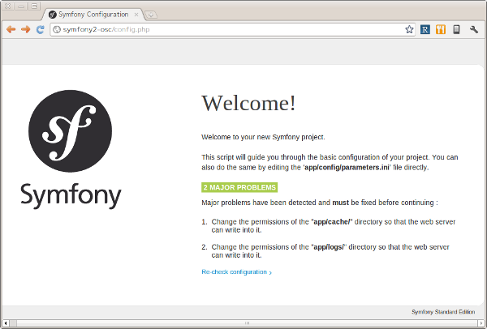
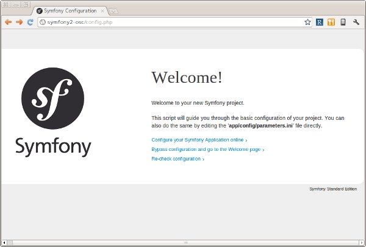
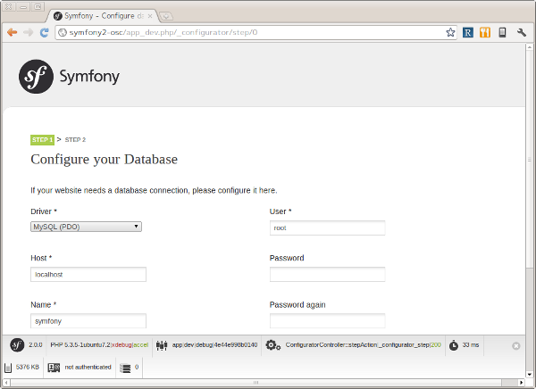
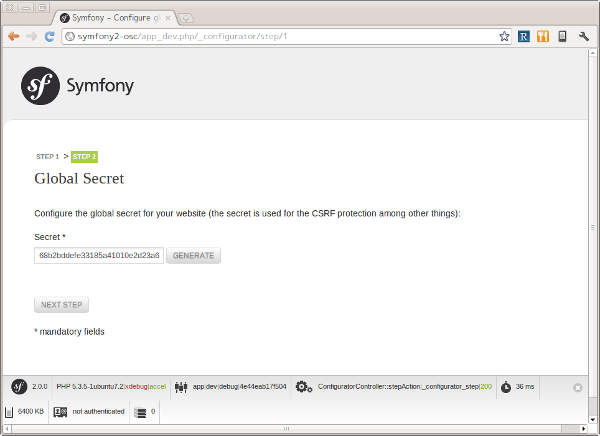
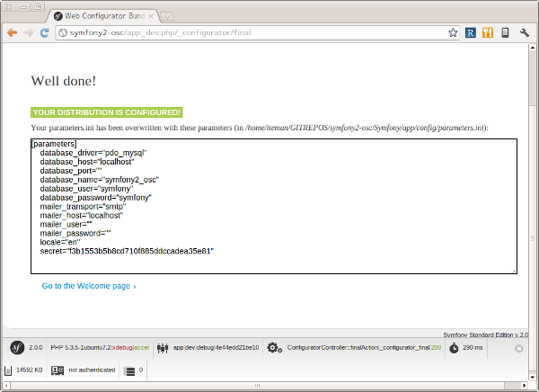

.. -*- coding: utf-8; -*-

====================================
アプリケーションと環境のセットアップ
====================================

Copyright (c) 2011 KUBO Atsuhiro <kubo@iteman.jp>, All rights reserved.

This work is licensed under the Creative Commons Attribution-ShareAlike 3.0 Unported License. To view a copy of this license, visit http://creativecommons.org/licenses/by-sa/3.0/ or send a letter to Creative Commons, 444 Castro Street, Suite 900, Mountain View, California, 94041, USA.

.. sectnum::

.. contents:: 目次

概要
====

このドキュメントでは `オープンソースカンファレンス2011 Nagoya PHPフレームワークSymfony2 開発チュートリアル <https://www.ospn.jp/osc2011-nagoya/modules/eguide/event.php?eid=13>`_ に参加される方に向けて、当日実際に手を動かしていただく場合に必要な事前準備について解説します。

.. note:: アプリケーションで使用するホスト名について

    本チュートリアルのアプリケーションのホスト名は **symfony2-osc** とします。お使いの環境に合わせて適宜読み替えてください。

動作環境
========

`Symfony2 の実行に必要な要件 | Symfony2日本語ドキュメント <http://docs.symfony.gr.jp/symfony2/reference/requirements.html>`_ を参考に動作環境をチェックします。本チュートリアルではDoctrineを使用するために `PDO拡張モジュール <http://www.php.net/manual/ja/book.pdo.php>`_ とデータベース固有のPDOドライバも必要となります。

Symfonyのインストール
=====================

`Symfony のインストールと設定 | Symfony2日本語ドキュメント <http://docs.symfony.gr.jp/symfony2/book/installation.html>`_ を参考にSymfonyをインストールします。以下は筆者の環境におけるインストールの例です。

最初にアーカイブを展開します。

.. code-block:: bash

    $ tar zxf /path/to/Symfony_Standard_Vendors_2.0.0.tgz

次に展開されたルートディレクトリの名称を変更します。

.. code-block:: bash

    $ mv Symfony symfony2-osc

次にコマンドラインから動作環境をチェックします。筆者の環境では設定パラメータ **date.timezone** の値が設定されていなかったためエラーが発生しました。

.. code-block:: bash

    $ cd /path/to/symfony2-osc
    $ php app/check.php 
    ********************************
    *                              *
    *  Symfony requirements check  *
    *                              *
    ********************************
    
    php.ini used by PHP: /path/to/php.ini
    
    ** WARNING **
    *  The PHP CLI can use a different php.ini file
    *  than the one used with your web server.
    *  If this is the case, please ALSO launch this
    *  utility from your web server.
    ** WARNING **
    
    ** Mandatory requirements **
    
      OK        Checking that PHP version is at least 5.3.2 (5.3.5-1ubuntu7.2 installed)
    
    
    [[ ERROR ]] Checking that the "date.timezone" setting is set: FAILED
                *** Set the "date.timezone" setting in php.ini (like Europe/Paris) ***
    You must fix this problem before resuming the check.

設定ファイルの該当箇所を **date.timezone = Asia/Tokyo** のように変更した上で再度チェックコマンドを実行したところ以下のような出力になりました。

.. code-block:: bash

    ********************************
    *                              *
    *  Symfony requirements check  *
    *                              *
    ********************************
    
    php.ini used by PHP: /path/to/php.ini
    
    ** WARNING **
    *  The PHP CLI can use a different php.ini file
    *  than the one used with your web server.
    *  If this is the case, please ALSO launch this
    *  utility from your web server.
    ** WARNING **
    
    ** Mandatory requirements **
    
      OK        Checking that PHP version is at least 5.3.2 (5.3.5-1ubuntu7.2 installed)
      OK        Checking that the "date.timezone" setting is set
      OK        Checking that app/cache/ directory is writable
      OK        Checking that the app/logs/ directory is writable
      OK        Checking that the json_encode() is available
      OK        Checking that the SQLite3 or PDO_SQLite extension is available
      OK        Checking that the session_start() is available
      OK        Checking that the ctype_alpha() is available
    
    ** Optional checks **
    
      OK        Checking that the PHP-XML module is installed
      OK        Checking that the libxml version is at least 2.6.21
      OK        Checking that the token_get_all() function is available
      OK        Checking that the mb_strlen() function is available
      OK        Checking that the iconv() function is available
      OK        Checking that the utf8_decode() is available
      OK        Checking that the posix_isatty() is available
      OK        Checking that the intl extension is available
      OK        Checking that the intl ICU version is at least 4+
      OK        Checking that a PHP accelerator is installed
      OK        Checking that the APC version is at least 3.0.17
      OK        Checking that php.ini has short_open_tag set to off
      OK        Checking that php.ini has magic_quotes_gpc set to off
      OK        Checking that php.ini has register_globals set to off
      OK        Checking that php.ini has session.auto_start set to off
    
    ** Optional checks (Doctrine) **
    
      OK        Checking that PDO is installed
      OK        Checking that PDO has some drivers installed: mysql, sqlite, sqlite2

次にブラウザから **http://symfony2-osc/config.php** にアクセスし、Webからも動作環境をチェックします。筆者の場合 **app/cache** と **app/logs** ディレクトリにWebサーバが書き込めないという問題が指摘されました。

ターミナルから実際に確認してみると、確かにWebサーバのユーザ・グループ(ユーザ: www-data, グループ: www-data)が書き込めないパーミッションになっていました。

.. code-block:: bash

    $ cd app
    $ ls -la
    ...
    drwxr-xr-x 2 iteman iteman  4096 2011-07-28 17:52 cache/
    ...
    drwxr-xr-x 2 iteman iteman  4096 2011-08-12 16:01 logs/
    ...

`Symfony のインストールと設定 | Symfony2日本語ドキュメント <http://docs.symfony.gr.jp/symfony2/book/installation.html>`_ に書かれているようにいくつかのパーミッションの設定方法があります。ここでは **ACLを使わない方法** を採用します。

まず、グループ権限で書き込めるようにパーミッションを変更します。

.. code-block:: bash

    $ chmod 2775 cache logs
    $ chgrp www-data cache logs
    $ ls -la
    ...
    drwxrwsr-x 2 iteman www-data  4096 2011-07-28 17:52 cache/
    ...
    drwxrwsr-x 2 iteman www-data  4096 2011-08-12 16:01 logs/
    ...

次に以下の行を **app/console**, **web/app.php**, **web/app_dev.php** の先頭に追加します。

.. code-block:: bash

    umask(0002); // This will let the permissions be 0775

再度ブラウザから **http://symfony2-osc/config.php** にアクセスします。

これでSymfonyのインストールは完了です。続いてこのページからSymfonyアプリケーションの設定を行うことができますが、その前にデータベースの設定を済ませておくことにしましょう。

データベースの作成
==================

本チュートリアルのアプリケーションはDoctrine経由でオブジェクトをデータベースに保存します。ここではデータベースの作成とデータベースユーザの作成を行います。

.. note:: RDBMSについて

    本チュートリアルで使用するRDBMSはMySQLとします。お使いの環境に合わせて適宜読み替えてください。

最初にデータベース **symfony2_osc** を作成します。

.. code-block:: bash

    mysql> create database symfony2_osc;
    Query OK, 1 row affected (0.00 sec)

次にユーザ **symfony** を作成します。パスワードは **symfony** とします。

.. code-block:: bash

    mysql> grant all on symfony2_osc.* to symfony@'localhost' identified by 'symfony' with grant option;
    Query OK, 0 rows affected (0.00 sec)

最後にコマンドラインから接続確認を行います。

.. code-block:: bash

    $ mysql -u symfony -p symfony2_osc
    Enter password: 
    Welcome to the MySQL monitor.  Commands end with ; or \g.
    Your MySQL connection id is 35
    Server version: 5.1.54-1ubuntu4 (Ubuntu)
    
    Copyright (c) 2000, 2010, Oracle and/or its affiliates. All rights reserved.
    This software comes with ABSOLUTELY NO WARRANTY. This is free software,
    and you are welcome to modify and redistribute it under the GPL v2 license
    
    Type 'help;' or '\h' for help. Type '\c' to clear the current input statement.
    
    mysql> 

Symfonyアプリケーションの設定
=============================

データベースの作成が完了したら、ブラウザから **http://symfony2-osc/config.php** にアクセスし、オンラインでSymfonyアプリケーションの設定を行います。ここで設定する内容は最終的に **app/config/parameters.ini** ファイルに書き込まれるため、あらかじめWebサーバから書き込めるようにしておく必要があります。

準備ができたらリンク **Configure your Symfony Application online** をクリックします。するとデータベース接続設定のページが表示されます。

フォームに接続情報を入力し **NEXT STEP** ボタンをクリックします。するとGlobal Secretの設定ページが表示されます。

**GENERATE** ボタンをクリックし、Secretを生成します。Secretが確定したら **NEXT STEP** ボタンをクリックします。すると設定内容の書き込みが行われ、その内容がページに表示されます。

最後にページ下部のリンク **Go to the Welcome page** をクリックしましょう。無事 **Welcome** ページが表示されれば、Symfonyアプリケーションの設定は完了です。

.. image:: images/welcome.png

参考
====

* `Symfony2 の実行に必要な要件 | Symfony2日本語ドキュメント <http://docs.symfony.gr.jp/symfony2/reference/requirements.html>`_
* `Symfony のインストールと設定 | Symfony2日本語ドキュメント <http://docs.symfony.gr.jp/symfony2/book/installation.html>`_
