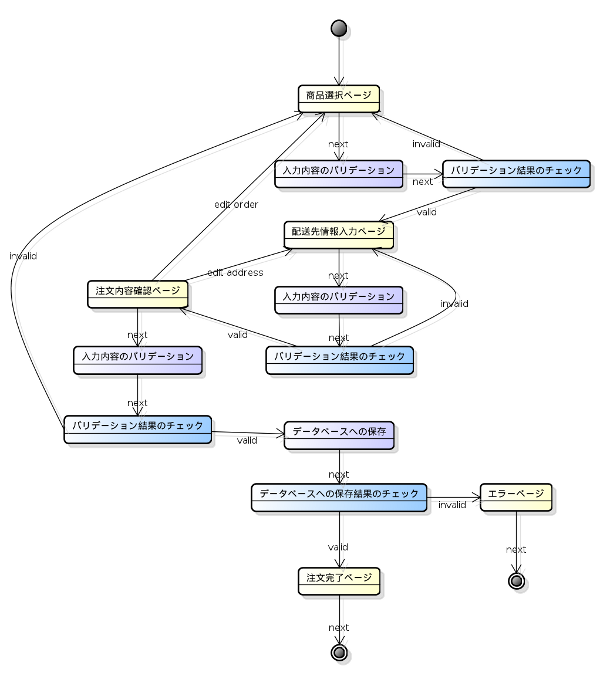
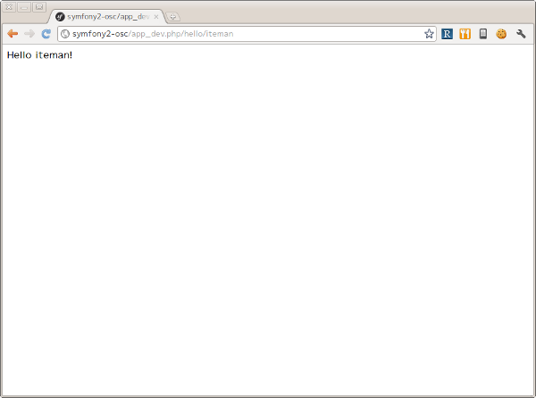
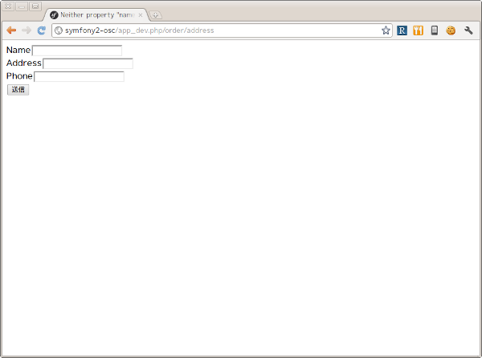

.. -*- coding: utf-8; -*-

============================================
PHPフレームワークSymfony2 開発チュートリアル
============================================
-----------------------------------------------------------
OSC2011 Nagoya PHPフレームワークSymfony2 開発チュートリアル
-----------------------------------------------------------

飲料注文アプリケーション
========================

今回作るのはオンラインで飲料を注文するためのアプリケーションです。このアプリケーションは以下のようなページフローを持ちます。

1. 最初のページではページ上から商品と個数を選択します。
2. 2番目のページでは配送先情報を入力します。
3. 3番目のページでは注文内容を確認し、問題なければ注文を確定します。内容を変更したい場合は最初のページか2番目のページに戻って再度情報を入力します。
4. 注文が確定するとお礼が書かれた最後のページを表示されます。

それぞれのページの入力内容は次のページを表示する前に検証を行います。注文を確定する際にはその内容をデータベースに保存する必要があります。これらを踏まえたページフローの全体像は以下のようになります。

では早速アプリケーションの作成に取り掛かります。

バンドルの作成
==============

Symfonyではフレームワークが提供する機能だけではなくユーザのアプリケーションもバンドルとして作成する必要があります。ここでは飲料注文アプリケーションを単一のバンドル(以下 **アプリケーションバンドル** )として作成することにします。

新たにバンドルを作成する方法としては以下のものがあります。

1. Standard Editionに含まれるAcmeDemoBundleを使用する。
2. Standard Editionに含まれるAcmeDemoBundleをコピーしたものを使用する。
3. コマンドラインの対話式ジェネレータで雛形を生成する。

今回はコマンドラインの対話式ジェネレータを使うことにします。ではターミナルから **app/console generate:bundle** コマンドを実行してみましょう。

.. code-block:: console

    $ app/console generate:bundle
    
                                                
      Welcome to the Symfony2 bundle generator  
                                                
    
    
    Your application code must be written in bundles. This command helps
    you generate them easily.
    
    Each bundle is hosted under a namespace (like Acme/Bundle/BlogBundle).
    The namespace should begin with a "vendor" name like your company name, your
    project name, or your client name, followed by one or more optional category
    sub-namespaces, and it should end with the bundle name itself
    (which must have Bundle as a suffix).
    
    Use / instead of \ for the namespace delimiter to avoid any problem.
    
    Bundle namespace: Osc/Bundle/DrinkOrderBundle <--- 飲料注文アプリケーションの名前空間を入力する。
    In your code, a bundle is often referenced by its name. It can be the
    concatenation of all namespace parts but it's really up to you to come
    up with a unique name (a good practice is to start with the vendor name).
    Based on the namespace, we suggest OscDrinkOrderBundle.
    
    Bundle name [OscDrinkOrderBundle]: <--- そのままEnterキーを押す。
    The bundle can be generated anywhere. The suggested default directory uses
    the standard conventions.
    
    Target directory [/path/to/symfony2-osc/src]: <--- そのままEnterキーを押す。
    Determine the format to use for the generated configuration.
    
    Configuration format (yml, xml, php, or annotation) [annotation]: yml <--- 設定のフォーマットをYAMLにする。
    To help you getting started faster, the command can generate some
    code snippets for you.
    
    Do you want to generate the whole directory structure [no]? yes <--- yesにするとpublic/css, public/images, public/jsディレクトリ他が作成される。
                                 
      Summary before generation  
                                 
    
    You are going to generate a "Osc\Bundle\DrinkOrderBundle\OscDrinkOrderBundle" bundle
    in "/path/to/symfony2-osc/src/" using the "yml" format.
    
    Do you confirm generation [yes]? <--- そのままEnterキーを押す。
                         
      Bundle generation  
                         
    
    Generating the bundle code: OK
    Checking that the bundle is autoloaded: OK
    Confirm automatic update of your Kernel [yes]? <--- そのままEnterキーを押す。
    Enabling the bundle inside the Kernel: OK
    Confirm automatic update of the Routing [yes]? <--- そのままEnterキーを押す。
    Importing the bundle routing resource: OK
    
                                                   
      You can now start using the generated code!  
                                                   
    
このコマンドによって以下のファイルおよびディレクトリが作成されました。

.. code-block:: console

    $ tree /path/to/symfony2-osc/src/Osc/
    src/Osc/
    └── Bundle
        └── DrinkOrderBundle
            ├── Controller
            │   └── DefaultController.php
            ├── DependencyInjection
            │   ├── Configuration.php
            │   └── OscDrinkOrderExtension.php
            ├── OscDrinkOrderBundle.php
            ├── Resources
            │   ├── config
            │   │   ├── routing.yml
            │   │   └── services.yml
            │   ├── doc
            │   │   └── index.rst
            │   ├── public
            │   │   ├── css
            │   │   ├── images
            │   │   └── js
            │   ├── translations
            │   │   └── messages.fr.xliff
            │   └── views
            │       └── Default
            │           └── index.html.twig
            └── Tests
                └── Controller
                    └── DefaultControllerTest.php
    
    16 directories, 10 files

加えて app/AppKernel.php および app/config/routing.yml が以下のように変更されました。

.. code-block:: diff

    diff --git a/app/AppKernel.php b/app/AppKernel.php
    index 5bd97b7..e7c508f 100644
    --- a/app/AppKernel.php
    +++ b/app/AppKernel.php
    @@ -17,6 +17,7 @@ class AppKernel extends Kernel
                 new Symfony\Bundle\AsseticBundle\AsseticBundle(),
                 new Sensio\Bundle\FrameworkExtraBundle\SensioFrameworkExtraBundle(),
                 new JMS\SecurityExtraBundle\JMSSecurityExtraBundle(),
    +            new Osc\Bundle\DrinkOrderBundle\OscDrinkOrderBundle(),
             );
     
             if (in_array($this->getEnvironment(), array('dev', 'test'))) {
    diff --git a/app/config/routing.yml b/app/config/routing.yml
    index 8b4740a..6468ab5 100644
    --- a/app/config/routing.yml
    +++ b/app/config/routing.yml
    @@ -1,3 +1,7 @@
    +OscDrinkOrderBundle:
    +    resource: "@OscDrinkOrderBundle/Resources/config/routing.yml"
    +    prefix:   /
    +
     # Internal routing configuration to handle ESI
     #_internal:
     #   resource: "@FrameworkBundle/Resources/config/routing/internal.xml"

コマンドの実行が終わったら **http://symfony2-osc/app_dev.php/hello/xxx** (xxx部分は任意の文字) にアクセスして動作を確認してみましょう。

問題なくページが表示されればバンドルの作成は完了です。以降は主にバンドル用のディレクトリ **src/Osc/Bundle/DrinkOrderBundle** 以下のファイルやディレクトリに対して変更を加えていくことになります。

.. note:: ドキュメントで使用されるパス

    ドキュメントで使用されるパスは **/path/to/symfony2-osc** ディレクトリを起点としています。本ドキュメントではこのディレクトリを **プロジェクトルート** と呼ぶことにします。また、DrinkOrderBundleのルートディレクトリ **src/Osc/Bundle/DrinkOrderBundle** を DrinkOrderBundle の **バンドルルート** と呼ぶことにします。

ページフローの実装
==================

では早速アプリケーションの実装を始めます。今回は最初にページフローを実装し、Web 上で一通りの動作が確認できるようにします。

最初のページ - 商品選択ページ
-----------------------------

まず本アプリケーションの最初のページである **商品選択ページ** を実装します。このページの **URL** は **/order** とします。

**リクエストメソッド** が **GET** の場合は商品選択フォームを出力します。 **POST** の場合は送信されたデータを検証してから次のページに遷移します。

最初にやることは、自動生成されたコントローラ **DefaultController** とビューテンプレート **Default** の名称の変更です。 **Default** では何をするものなのか意図がわからないので **DrinkOrder** に変更します。さらにコントローラのアクション名を **index** から **product** に変更します。

+----------------------------------------+-----------------------------------------+----------------------------------------------+
| **コントローラのファイル名**           | Controller/DefaultController.php        | Controller/DrinkOrderController.php          |
+----------------------------------------+-----------------------------------------+----------------------------------------------+
| **コントローラのクラス名**             | DefaultController                       | DrinkOrderController                         |
+----------------------------------------+-----------------------------------------+----------------------------------------------+
| **コントローラのアクション名**         | indexAction                             | productAction                                |
+----------------------------------------+-----------------------------------------+----------------------------------------------+
| **ビューテンプレートのファイル名**     | Resources/views/Default/index.html.twig | Resources/views/DrinkOrder/product.html.twig |
+----------------------------------------+-----------------------------------------+----------------------------------------------+

加えて、ルート名、URLパターン、ビューテンプレートの内容を以下のように変更します。

+------------------------------+------------------------------+-----------------------------+
| **ルート名**                 | OscDrinkOrderBundle_homepage | OscDrinkOrderBundle_product |
+------------------------------+------------------------------+-----------------------------+
| **URLパターン**              | /hello/{name}                | /product                    |
+------------------------------+------------------------------+-----------------------------+
| **ビューテンプレートの内容** | Hello {{ name }}!            | Hello!                      |
+------------------------------+------------------------------+-----------------------------+

最終的にファイル名以外の変更は以下のようになりました。

.. code-block:: diff

    diff --git a/src/Osc/Bundle/DrinkOrderBundle/Controller/DrinkOrderController.php b/src/Osc/Bundle/DrinkOrderBundle/Controller/DrinkOrderController.php
    index 01b92e8..483657c 100644
    --- a/src/Osc/Bundle/DrinkOrderBundle/Controller/DrinkOrderController.php
    +++ b/src/Osc/Bundle/DrinkOrderBundle/Controller/DrinkOrderController.php
    @@ -5,11 +5,11 @@ namespace Osc\Bundle\DrinkOrderBundle\Controller;
     use Symfony\Bundle\FrameworkBundle\Controller\Controller;
     
     
    -class DefaultController extends Controller
    +class DrinkOrderController extends Controller
     {
         
    -    public function indexAction($name)
    +    public function productAction()
         {
    -        return $this->render('OscDrinkOrderBundle:Default:index.html.twig', array('name' => $name));
    +        return $this->render('OscDrinkOrderBundle:DrinkOrder:product.html.twig');
         }
     }
    diff --git a/src/Osc/Bundle/DrinkOrderBundle/Resources/config/routing.yml b/src/Osc/Bundle/DrinkOrderBundle/Resources/config/routing.yml
    index 7cb0283..9a92e9d 100644
    --- a/src/Osc/Bundle/DrinkOrderBundle/Resources/config/routing.yml
    +++ b/src/Osc/Bundle/DrinkOrderBundle/Resources/config/routing.yml
    @@ -1,3 +1,3 @@
    -OscDrinkOrderBundle_homepage:
    -    pattern:  /hello/{name}
    -    defaults: { _controller: OscDrinkOrderBundle:Default:index }
    +OscDrinkOrderBundle_product:
    +    pattern:  /product
    +    defaults: { _controller: OscDrinkOrderBundle:DrinkOrder:product }
    diff --git a/src/Osc/Bundle/DrinkOrderBundle/Resources/views/DrinkOrder/product.html.twig b/src/Osc/Bundle/DrinkOrderBundle/Resources/views/DrinkOrder/product.html.twig
    index 4ce626e..10ddd6d 100644
    --- a/src/Osc/Bundle/DrinkOrderBundle/Resources/views/DrinkOrder/product.html.twig
    +++ b/src/Osc/Bundle/DrinkOrderBundle/Resources/views/DrinkOrder/product.html.twig
    @@ -1 +1 @@
    -Hello {{ name }}!
    +Hello!
    

変更が終わったら **http://symfony2-osc/app_dev.php/order** にアクセスします。 **Hello!** と表示されれば変更は無事完了です。

.. note:: キャッシュのクリア

    Symfonyのキャッシュが原因でアプリケーションが期待通りに動作しない場合があります。疑わしい場合は **app/console cache:clear** コマンドを使ってキャッシュをクリアするようにしましょう。

商品選択フォームの作成
^^^^^^^^^^^^^^^^^^^^^^

前準備が整ったところで、商品選択ページを作っていきます。商品選択フォームの作成にはSymfonyが提供する `フォーム <http://docs.symfony.gr.jp/symfony2/book/forms.html>`_ 機能を使います。フォームの中心にあるのは **Form** オブジェクトです。今回は **Controller::createFormBuilder()** メソッドを使ってFormオブジェクトを作ることにします。コントローラを以下のように変更してみましょう。

**Controller/DrinkOrderController.php** :

.. code-block:: php

    <?php
    
    namespace Osc\Bundle\DrinkOrderBundle\Controller;
    
    use Symfony\Bundle\FrameworkBundle\Controller\Controller;
    
    use Osc\Bundle\OscDrinkOrderBundle\Entity\DrinkOrder;

    class DrinkOrderController extends Controller
    {
        
        public function productAction()
        {
            $form = $this->createFormBuilder(new DrinkOrder())
                ->add('product_id', 'choice', array( 'choices' => array('1' => 'BlueBull 128個入ケース', '2' => 'GreenBull 128個入ケース')))
                ->add('quantity', 'text')
                ->getForm();
            return $this->render('OscDrinkOrderBundle:DrinkOrder:product.html.twig', array('form' => $form->createView()));
        }
    }
    

Controller::createFormBuilder()メソッドの返り値を使って直接フォームの要素を定義しています。1つ目のフィールドproduct_idは商品選択のためのフィールドです。実際には商品はデータベースから取得される場合がほとんどでしょう。ここではアプリケーションを簡単にするために直接定義します。2つ目のフィールドquantityは個数を入力するためのフィールドです。今回は商品に価格も定義されていないため、注文いただいた個数をどーんと無料で差し上げることにしましょう。

Controller::render()メソッドの引数にはFormオブジェクトから作成したFormViewオブジェクトを渡しています。FormViewオブジェクトはテンプレートのヘルパー関数から参照するために使われます。

次はテンプレートの変更です。

**Resources/views/DrinkOrder/product.html.twig** :

.. code-block:: html+jinja

    <form action="{{ path('OscDrinkOrderBundle_product') }}" method="post" {{ form_enctype(form) }}>
      {{ form_widget(form) }}
      <input type="submit" />
    </form>

コントローラで定義したフォームフィールドを、ヘルパー関数form_widget()を使って描画するようにしています。ヘルパー関数path()はSymfonyのルート名からURLを作成してくれる便利な関数です。これでフォーム定義は完了といきたいところですが、まだやらないといけないことが残っています…

エンティティの作成
^^^^^^^^^^^^^^^^^^

ここでController::createFormBuilder()メソッドに渡された **DrinkOrder** オブジェクトに注目してください。Controller::createFormBuilder()メソッドは連想配列またはオブジェクトを受け取りますが、唐突に現れたこのオブジェクトは一体何者でしょうか？このオブジェクトは飲料注文という問題領域の概念モデルである **ドメインモデル** を表現するオブジェクトのひとつであり **ドメインオブジェクト** と呼ばれるものです。さらにDrinkOrderオブジェクトは **エンティティ** でもあります。エンティティとは *主として同一性によって定義されるオブジェクト(『エリック・エヴァンスのドメイン駆動設計』より)* です。エンティティはHTTPリクエスト、ページフロー、業務フローなどを超えた連続性を維持する必要があるため、たいていの場合データベースなどに永続化されることになります。 **Symfonyは我々開発者がドメインモデルを中心としたアプリケーション開発を行いやすいように注意深く設計されたフレームワークである** と筆者は考えています。

さて、ここで現段階で存在していないDrinkOrderオブジェクトを新たに作る必要があります。これには **app/console doctrine:generate:entity** コマンドを使うことができます。

.. code-block:: console

    $ app/console doctrine:generate:entity
    
                                                 
      Welcome to the Doctrine2 entity generator  
                                                 
    
    
    This command helps you generate Doctrine2 entities.
    
    First, you need to give the entity name you want to generate.
    You must use the shortcut notation like AcmeBlogBundle:Post.
    
    The Entity shortcut name: OscDrinkOrderBundle:DrinkOrder <-- ショートカット記法でエンティティの名称を入力する。
    
    Determine the format to use for the mapping information.
    
    Configuration format (yml, xml, php, or annotation) [annotation]: yml <-- 今回はYAMLを使う。
    
    Instead of starting with a blank entity, you can add some fields now.
    Note that the primary key will be added automatically (named id).
    
    Available types: array, object, boolean, integer, smallint, 
    bigint, string, text, datetime, datetimetz, date, time, decimal, float.
    
    New field name (press <return> to stop adding fields): product_id <-- エンティティのフィールド名を入力する。
    Field type [integer]: <-- エンティティフィールドの型を入力する。
    
    New field name (press <return> to stop adding fields): quantity
    Field type [string]: integer
    
    New field name (press <return> to stop adding fields): 
    
    Do you want to generate an empty repository class [no]? no <-- 空のリポジトリクラスを作成するかどうか？
    
                                 
      Summary before generation  
                                 
    
    You are going to generate a "OscDrinkOrderBundle:DrinkOrder" Doctrine2 entity
    using the "yml" format.
    
    Do you confirm generation [yes]? <--- そのままEnterキーを押す。
    
                         
      Entity generation  
                         
    
    Generating the entity code: OK
    
                                                   
      You can now start using the generated code!  
                                                   
    
ここでは前述のフォームに定義したproduct_idおよびquantityフィールドをエンティティに定義しています。このコマンドによって作成されたファイルは2つ、1つはエンティティであるEntity/DrinkOrder.php, もう1つはエンティティとデータベースレコードをマッピングするための定義ファイルResources/config/doctrine/DrinkOrder.orm.ymlです。それぞれの内容を確認してみましょう。

**Entity/DrinkOrder.php** :

.. code-block:: php

    <?php
    
    namespace Osc\Bundle\DrinkOrderBundle\Entity;
    
    use Doctrine\ORM\Mapping as ORM;
    
    /**
     * Osc\Bundle\DrinkOrderBundle\Entity\DrinkOrder
     */
    class DrinkOrder
    {
        /**
         * @var integer $id
         */
        private $id;
    
        /**
         * @var integer $product_id
         */
        private $product_id;
    
        /**
         * @var integer $quantity
         */
        private $quantity;
    
    
        /**
         * Get id
         *
         * @return integer 
         */
        public function getId()
        {
            return $this->id;
        }
    
        /**
         * Set product_id
         *
         * @param integer $productId
         */
        public function setProductId($productId)
        {
            $this->product_id = $productId;
        }
    
        /**
         * Get product_id
         *
         * @return integer 
         */
        public function getProductId()
        {
            return $this->product_id;
        }
    
        /**
         * Set quantity
         *
         * @param integer $quantity
         */
        public function setQuantity($quantity)
        {
            $this->quantity = $quantity;
        }
    
        /**
         * Get quantity
         *
         * @return integer 
         */
        public function getQuantity()
        {
            return $this->quantity;
        }
    }

コマンドで明示的に定義したproduct_idおよびquantityフィールドがprivateフィールドとして宣言され、それぞれのセッタ・ゲッタメソッドも宣言されています。加えてエンティティの同一性を表現するためのidフィールドとゲッタメソッドが宣言されています。Doctrine\ORM\Mappingのuseステートメントはマッピング定義にアノテーションを使う場合に必要なものなので、今回は削除しておきましょう。

**Resources/config/doctrine/DrinkOrder.orm.yml** :

.. code-block:: yaml

    Osc\Bundle\DrinkOrderBundle\Entity\DrinkOrder:
      type: entity
      table: null
      fields:
        id:
          type: integer
          id: true
          generator:
            strategy: AUTO
        product_id:
          type: integer
        quantity:
          type: integer
      lifecycleCallbacks: {  }

エンティティと同様にコマンドで定義したproduct_idおよびquantityフィールド、そしてidフィールドが宣言されています。table要素がnullの場合、この後のコマンドによるテーブル作成時にエンティティの名称であるDrinkOrderがそのままテーブル名として使われることになります。今回のテーブル名は小文字のdrink_orderにしたいのでtable要素をdrink_orderに書き換えておきます。

ここまでの変更が終わったら **http://symfony2-osc/app_dev.php/order** にアクセスします。無事フォームが表示されたでしょうか？

.. image:: images/form-product.png

.. note:: ドメインオブジェクトの配置場所

    ジェネレータによって生成されるエンティティはデフォルトでバンドル配下のEntityディレクトリに配置されます。しかし、エンティティを始めとするドメインオブジェクトは我々のドメインのものであり、Symfony独自のシステムであるバンドルからは本質的に独立したものです。例えば、Symfony以外のフレームワークを使った別のアプリケーションで同じエンティティを共有するケースを考えてみてください。適切な配置先はどこでしょうか？バンドルと同じソースツリーに配置するのであれば **src/ApplicationNamespace/Domain** ディレクトリを使うことは良い選択です。複数のプロジェクトから共有される場合は、ドメインオブジェクトのみを別のプロジェクトとすることができます。ただし、この選択は実際の要求があるまで遅らせることができます。

2つ目のページ - 配送先情報入力ページ
------------------------------------

次に2つ目のページである **配送先情報入力ページ** を実装します。このページの **URL** は **/order/address** とします。

**リクエストメソッド** が **GET** の場合は配送先情報入力フォームを出力します。 **POST** の場合は送信されたデータを検証してから次のページに遷移します。

ルートの定義
^^^^^^^^^^^^

前述の商品選択ページの場合ジェネレータによって生成されたルートを変更しましたが、このページには対応するルートがありませんので最初にルートを定義しましょう。defaults配列の_controller要素の値は、このルートのアクションがDrinkOrderController::addressAction()メソッドであることを示しています。

**Resources/config/routing.yml** :

.. code-block:: yaml

    ...
    OscDrinkOrderBundle_address:
        pattern:  /order/address
        defaults: { _controller: OscDrinkOrderBundle:DrinkOrder:address }

配送先情報入力フォームの作成
^^^^^^^^^^^^^^^^^^^^^^^^^^^^

次にコントローラで配送先情報入力フォームを定義します。このフォームではname, address, phoneの3つのフィールドを入力できるようにします。nameはお名前、addressは住所、phoneは電話番号となっています。

**Controller/DrinkOrderController.php** :

.. code-block:: php

    ...
    class DrinkOrderController extends Controller
    {
    ...
        public function addressAction()
        {
            $form = $this->createFormBuilder(new DrinkOrder())
                ->add('name', 'text')
                ->add('address', 'text')
                ->add('phone', 'text')
                ->getForm();
            return $this->render('OscDrinkOrderBundle:DrinkOrder:address.html.twig', array('form' => $form->createView()));
        }

続いてaddressAction()メソッドから描画されるテンプレートを作成します。内容としては前述のproduct.html.twigとほぼ同じとなっておりform要素のaction属性の値が異なるだけです。

**Resources/views/DrinkOrder/address.html.twig** :

.. code-block:: html+jinja

    <form action="{{ path('OscDrinkOrderBundle_address') }}" method="post" {{ form_enctype(form) }}>
      {{ form_widget(form) }}
      <input type="submit" />
    </form>

この段階ではまだフォームを表示することはできません。フォームに定義したフィールドname, address, phoneのアクセサメソッドが存在しないためです。

エンティティの更新
^^^^^^^^^^^^^^^^^^

エンティティの作成に使った **app/console doctrine:generate:entity** コマンドは更新には対応していません。エンティティの更新を手作業で行うこともできますが、今回はデータベースと対応するフィールドの追加になるため、フィールドとセッタ・ゲッタメソッドすべての宣言を追加しなければならないので少々面倒です。さらにエンティティのみを更新すると、後でマッピング定義との同期を行うことになり、これも面倒です。幸いSymfonyのDoctrineインテグレーションはマッピング定義からのエンティティの自動更新をサポートしていますので、この方法で対応するのが良さそうです。

最初に以下のようにマッピング定義にname, address, phoneフィールドを追加しましょう。

**Resources/config/doctrine/DrinkOrder.orm.yml** :

.. code-block:: yaml

    ...
        quantity:
          type: integer
        name:
          type: string
          length: 255
        address:
          type: string
          length: 255
        phone:
          type: string
          length: 255
      lifecycleCallbacks: {  }

次に **app/console doctrine:generate:entities** コマンドを実行します。

.. code-block:: bash

    $ app/console doctrine:generate:entities OscDrinkOrderBundle:DrinkOrder
    Generating entity "Osc\Bundle\DrinkOrderBundle\Entity\DrinkOrder"
      > generating Osc\Bundle\DrinkOrderBundle\Entity\DrinkOrder

以下はコマンド実行後のエンティティです。クラスの末尾にフィールドとセッタ・ゲッタメソッドが追加されたことがわかります。

**Entity/DrinkOrder.php** :

.. code-block:: php

    ...
        /**
         * Get quantity
         *
         * @return integer
         */
        public function getQuantity()
        {
            return $this->quantity;
        }
        /**
         * @var string $name
         */
        private $name;
    
        /**
         * @var string $address
         */
        private $address;
    
        /**
         * @var string $phone
         */
        private $phone;
    
    
        /**
         * Set name
         *
         * @param string $name
         */
        public function setName($name)
        {
            $this->name = $name;
        }
    
        /**
         * Get name
         *
         * @return string 
         */
        public function getName()
        {
            return $this->name;
        }
    
        /**
         * Set address
         *
         * @param string $address
         */
        public function setAddress($address)
        {
            $this->address = $address;
        }
    
        /**
         * Get address
         *
         * @return string 
         */
        public function getAddress()
        {
            return $this->address;
        }
    
        /**
         * Set phone
         *
         * @param string $phone
         */
        public function setPhone($phone)
        {
            $this->phone = $phone;
        }
    
        /**
         * Get phone
         *
         * @return string 
         */
        public function getPhone()
        {
            return $this->phone;
        }
    }

ただし、このようにバラバラとフィールドとメソッドが追加されるままにしておくとソースコードの可読性を下げてしまうため、手作業で適切な箇所に再配置しておくことをお勧めします。

では **http://symfony2-osc/app_dev.php/order/address** にアクセスし、配送先情報入力フォームが表示されることを確認しましょう。

参考
====

* `フォーム | Symfony2日本語ドキュメント <http://docs.symfony.gr.jp/symfony2/book/forms.html>`_
* `ルーティング | Symfony2日本語ドキュメント <http://docs.symfony.gr.jp/symfony2/book/routing.html#controller-string-syntax>`_
* `ビジネスオブジェクト - Wikipedia <http://ja.wikipedia.org/wiki/%E3%83%93%E3%82%B8%E3%83%8D%E3%82%B9%E3%82%AA%E3%83%96%E3%82%B8%E3%82%A7%E3%82%AF%E3%83%88>`_
* `ドメインモデル - Wikipedia <http://ja.wikipedia.org/wiki/%E3%83%89%E3%83%A1%E3%82%A4%E3%83%B3%E3%83%A2%E3%83%87%E3%83%AB>`_
* `『エリック・エヴァンスのドメイン駆動設計 (IT Architects’Archive ソフトウェア開発の実践 )』、翔泳社、2011年、ISBN 978­4798121963 <http://www.amazon.co.jp/%E3%82%A8%E3%83%AA%E3%83%83%E3%82%AF%E3%83%BB%E3%82%A8%E3%83%B4%E3%82%A1%E3%83%B3%E3%82%B9%E3%81%AE%E3%83%89%E3%83%A1%E3%82%A4%E3%83%B3%E9%A7%86%E5%8B%95%E8%A8%AD%E8%A8%88-Architects%E2%80%99Archive-%E3%82%BD%E3%83%95%E3%83%88%E3%82%A6%E3%82%A7%E3%82%A2%E9%96%8B%E7%99%BA%E3%81%AE%E5%AE%9F%E8%B7%B5-%E3%82%A8%E3%83%AA%E3%83%83%E3%82%AF%E3%83%BB%E3%82%A8%E3%83%B4%E3%82%A1%E3%83%B3%E3%82%B9/dp/4798121967>`_
