.. -*- coding: utf-8; -*-

============================================
PHPフレームワークSymfony2 開発チュートリアル
============================================

Copyright (c) 2011 KUBO Atsuhiro <kubo@iteman.jp>, All rights reserved.

This work is licensed under the Creative Commons Attribution-ShareAlike 3.0 Unported License. To view a copy of this license, visit http://creativecommons.org/licenses/by-sa/3.0/ or send a letter to Creative Commons, 444 Castro Street, Suite 900, Mountain View, California, 94041, USA.

.. sectnum::

.. contents:: 目次

はじめに
========

このチュートリアルではSymfonyのWebアプリケーションフレームワーク部分にフォーカスを当て、Symfonyを使って少し複雑なページフローを持つアプリケーションをどのように実装するのかについて説明します。

飲料注文アプリケーション
========================

今回作るのはオンラインで飲料を注文するためのアプリケーションです。このアプリケーションは以下のようなページフローを持ちます。

1. 最初のページではページ上から商品と個数を選択します。
2. 2番目のページでは配送先情報を入力します。
3. 3番目のページでは注文内容を確認し、問題なければ注文を確定します。内容を変更したい場合は最初のページか2番目のページに戻って再度情報を入力します。
4. 注文が確定するとお礼が書かれた最後のページを表示されます。

それぞれのページの入力内容は次のページを表示する前に検証を行います。注文を確定する際にはその内容をデータベースに保存する必要があります。これらを踏まえたページフローの全体像は以下のようになります。

.. image:: images/page-flow.png

では早速アプリケーションの作成に取り掛かります。

バンドルの作成
==============

Symfonyではフレームワークが提供する機能だけではなくユーザのアプリケーションもバンドルとして作成する必要があります。ここでは飲料注文アプリケーションを単一のバンドル(以下 **アプリケーションバンドル** )として作成することにします。

新たにバンドルを作成する方法としては以下のものがあります。

1. Standard Editionに含まれるAcmeDemoBundleを使用する。
2. Standard Editionに含まれるAcmeDemoBundleをコピーしたものを使用する。
3. コマンドラインの対話式ジェネレータで雛形を生成する。

今回はコマンドラインの対話式ジェネレータを使うことにします。ではターミナルから **app/console generate:bundle** コマンドを実行してみましょう。

.. code-block:: console

    $ app/console generate:bundle
    
                                                
      Welcome to the Symfony2 bundle generator  
                                                
    
    
    Your application code must be written in bundles. This command helps
    you generate them easily.
    
    Each bundle is hosted under a namespace (like Acme/Bundle/BlogBundle).
    The namespace should begin with a "vendor" name like your company name, your
    project name, or your client name, followed by one or more optional category
    sub-namespaces, and it should end with the bundle name itself
    (which must have Bundle as a suffix).
    
    Use / instead of \ for the namespace delimiter to avoid any problem.
    
    Bundle namespace: Osc/Bundle/DrinkOrderBundle <--- 飲料注文アプリケーションの名前空間を入力する。
    In your code, a bundle is often referenced by its name. It can be the
    concatenation of all namespace parts but it's really up to you to come
    up with a unique name (a good practice is to start with the vendor name).
    Based on the namespace, we suggest OscDrinkOrderBundle.
    
    Bundle name [OscDrinkOrderBundle]: <--- そのままEnterキーを押す。
    The bundle can be generated anywhere. The suggested default directory uses
    the standard conventions.
    
    Target directory [/path/to/symfony2-osc/src]: <--- そのままEnterキーを押す。
    Determine the format to use for the generated configuration.
    
    Configuration format (yml, xml, php, or annotation) [annotation]: yml <--- 設定のフォーマットをYAMLにする。
    To help you getting started faster, the command can generate some
    code snippets for you.
    
    Do you want to generate the whole directory structure [no]? yes <--- yesにするとpublic/css, public/images, public/jsディレクトリ他が作成される。
                                 
      Summary before generation  
                                 
    
    You are going to generate a "Osc\Bundle\DrinkOrderBundle\OscDrinkOrderBundle" bundle
    in "/path/to/symfony2-osc/src/" using the "yml" format.
    
    Do you confirm generation [yes]? <--- そのままEnterキーを押す。
                         
      Bundle generation  
                         
    
    Generating the bundle code: OK
    Checking that the bundle is autoloaded: OK
    Confirm automatic update of your Kernel [yes]? <--- そのままEnterキーを押す。
    Enabling the bundle inside the Kernel: OK
    Confirm automatic update of the Routing [yes]? <--- そのままEnterキーを押す。
    Importing the bundle routing resource: OK
    
                                                   
      You can now start using the generated code!  
                                                   
    
このコマンドによって以下のファイルおよびディレクトリが作成されました。

.. code-block:: console

    $ tree /path/to/symfony2-osc/src/Osc/
    src/Osc/
    └── Bundle
        └── DrinkOrderBundle
            ├── Controller
            │   └── DefaultController.php
            ├── DependencyInjection
            │   ├── Configuration.php
            │   └── OscDrinkOrderExtension.php
            ├── OscDrinkOrderBundle.php
            ├── Resources
            │   ├── config
            │   │   ├── routing.yml
            │   │   └── services.yml
            │   ├── doc
            │   │   └── index.rst
            │   ├── public
            │   │   ├── css
            │   │   ├── images
            │   │   └── js
            │   ├── translations
            │   │   └── messages.fr.xliff
            │   └── views
            │       └── Default
            │           └── index.html.twig
            └── Tests
                └── Controller
                    └── DefaultControllerTest.php
    
    16 directories, 10 files

加えて app/AppKernel.php および app/config/routing.yml が以下のように変更されました。

.. code-block:: diff

    diff --git a/app/AppKernel.php b/app/AppKernel.php
    index 5bd97b7..e7c508f 100644
    --- a/app/AppKernel.php
    +++ b/app/AppKernel.php
    @@ -17,6 +17,7 @@ class AppKernel extends Kernel
                 new Symfony\Bundle\AsseticBundle\AsseticBundle(),
                 new Sensio\Bundle\FrameworkExtraBundle\SensioFrameworkExtraBundle(),
                 new JMS\SecurityExtraBundle\JMSSecurityExtraBundle(),
    +            new Osc\Bundle\DrinkOrderBundle\OscDrinkOrderBundle(),
             );
     
             if (in_array($this->getEnvironment(), array('dev', 'test'))) {
    diff --git a/app/config/routing.yml b/app/config/routing.yml
    index 8b4740a..6468ab5 100644
    --- a/app/config/routing.yml
    +++ b/app/config/routing.yml
    @@ -1,3 +1,7 @@
    +OscDrinkOrderBundle:
    +    resource: "@OscDrinkOrderBundle/Resources/config/routing.yml"
    +    prefix:   /
    +
     # Internal routing configuration to handle ESI
     #_internal:
     #   resource: "@FrameworkBundle/Resources/config/routing/internal.xml"

コマンドの実行が終わったら **http://symfony2-osc/app_dev.php/hello/xxx** (xxx部分は任意の文字) にアクセスして動作を確認してみましょう。

.. image:: images/hello.png

問題なくページが表示されればバンドルの作成は完了です。以降は主にバンドル用のディレクトリ **src/Osc/Bundle/DrinkOrderBundle** 以下のファイルやディレクトリに対して変更を加えていくことになります。

.. note:: ドキュメントで使用されるパス

    ドキュメントで使用されるパスは **/path/to/symfony2-osc** ディレクトリを起点としています。本ドキュメントではこのディレクトリを **プロジェクトルート** と呼ぶことにします。また、DrinkOrderBundleのルートディレクトリ **src/Osc/Bundle/DrinkOrderBundle** を DrinkOrderBundle の **バンドルルート** と呼ぶことにします。

ページフローの実装
==================

では早速アプリケーションの実装を始めます。今回は最初にページフローを実装し、Web上で一通りのページ遷移が確認できるようにします。

最初のページ - 商品選択ページ
-----------------------------

まず本アプリケーションの最初のページである **商品選択ページ** を実装します。このページの **URL** は **/order** とします。

**リクエストメソッド** が **GET** の場合は商品選択フォームを出力します。 **POST** の場合は送信されたデータを検証してから次のページに遷移します。

最初にやることは、自動生成されたコントローラ **DefaultController** とビューテンプレート **Default** の名称の変更です。 **Default** では何をするものなのか意図がわからないので **DrinkOrder** に変更します。さらにコントローラのアクション名を **index** から **product** に変更します。

+----------------------------------------+-----------------------------------------+----------------------------------------------+
| **コントローラのファイル名**           | Controller/DefaultController.php        | Controller/DrinkOrderController.php          |
+----------------------------------------+-----------------------------------------+----------------------------------------------+
| **コントローラのクラス名**             | DefaultController                       | DrinkOrderController                         |
+----------------------------------------+-----------------------------------------+----------------------------------------------+
| **コントローラのアクション名**         | indexAction                             | productAction                                |
+----------------------------------------+-----------------------------------------+----------------------------------------------+
| **ビューテンプレートのファイル名**     | Resources/views/Default/index.html.twig | Resources/views/DrinkOrder/product.html.twig |
+----------------------------------------+-----------------------------------------+----------------------------------------------+

加えて、ルート名、URLパターン、ビューテンプレートの内容を以下のように変更します。

+------------------------------+------------------------------+-----------------------------+
| **ルート名**                 | OscDrinkOrderBundle_homepage | OscDrinkOrderBundle_product |
+------------------------------+------------------------------+-----------------------------+
| **URLパターン**              | /hello/{name}                | /order                      |
+------------------------------+------------------------------+-----------------------------+
| **ビューテンプレートの内容** | Hello {{ name }}!            | Hello!                      |
+------------------------------+------------------------------+-----------------------------+

最終的にファイル名以外の変更は以下のようになりました。

.. code-block:: diff

    diff --git a/src/Osc/Bundle/DrinkOrderBundle/Controller/DrinkOrderController.php b/src/Osc/Bundle/DrinkOrderBundle/Controller/DrinkOrderController.php
    index 01b92e8..483657c 100644
    --- a/src/Osc/Bundle/DrinkOrderBundle/Controller/DrinkOrderController.php
    +++ b/src/Osc/Bundle/DrinkOrderBundle/Controller/DrinkOrderController.php
    @@ -5,11 +5,11 @@ namespace Osc\Bundle\DrinkOrderBundle\Controller;
     use Symfony\Bundle\FrameworkBundle\Controller\Controller;
     
     
    -class DefaultController extends Controller
    +class DrinkOrderController extends Controller
     {
         
    -    public function indexAction($name)
    +    public function productAction()
         {
    -        return $this->render('OscDrinkOrderBundle:Default:index.html.twig', array('name' => $name));
    +        return $this->render('OscDrinkOrderBundle:DrinkOrder:product.html.twig');
         }
     }
    diff --git a/src/Osc/Bundle/DrinkOrderBundle/Resources/config/routing.yml b/src/Osc/Bundle/DrinkOrderBundle/Resources/config/routing.yml
    index 7cb0283..9a92e9d 100644
    --- a/src/Osc/Bundle/DrinkOrderBundle/Resources/config/routing.yml
    +++ b/src/Osc/Bundle/DrinkOrderBundle/Resources/config/routing.yml
    @@ -1,3 +1,3 @@
    -OscDrinkOrderBundle_homepage:
    -    pattern:  /hello/{name}
    -    defaults: { _controller: OscDrinkOrderBundle:Default:index }
    +OscDrinkOrderBundle_product:
    +    pattern:  /order
    +    defaults: { _controller: OscDrinkOrderBundle:DrinkOrder:product }
    diff --git a/src/Osc/Bundle/DrinkOrderBundle/Resources/views/DrinkOrder/product.html.twig b/src/Osc/Bundle/DrinkOrderBundle/Resources/views/DrinkOrder/product.html.twig
    index 4ce626e..10ddd6d 100644
    --- a/src/Osc/Bundle/DrinkOrderBundle/Resources/views/DrinkOrder/product.html.twig
    +++ b/src/Osc/Bundle/DrinkOrderBundle/Resources/views/DrinkOrder/product.html.twig
    @@ -1 +1 @@
    -Hello {{ name }}!
    +Hello!
    

変更が終わったら **http://symfony2-osc/app_dev.php/order** にアクセスします。 **Hello!** と表示されれば変更は無事完了です。

.. note:: キャッシュのクリア

    Symfonyのキャッシュが原因でアプリケーションが期待通りに動作しない場合があります。疑わしい場合は **app/console cache:clear** コマンドを使ってキャッシュをクリアするようにしましょう。

商品選択フォームの作成
^^^^^^^^^^^^^^^^^^^^^^

前準備が整ったところで、商品選択ページを作っていきます。商品選択フォームの作成にはSymfonyが提供する `フォーム <http://docs.symfony.gr.jp/symfony2/book/forms.html>`_ 機能を使います。フォームの中心にあるのは **Form** オブジェクトです。今回は **Controller::createFormBuilder()** メソッドを使ってFormオブジェクトを作ることにします。コントローラを以下のように変更してみましょう。

**Controller/DrinkOrderController.php** :

.. code-block:: php

    <?php
    
    namespace Osc\Bundle\DrinkOrderBundle\Controller;
    
    use Symfony\Bundle\FrameworkBundle\Controller\Controller;
    
    use Osc\Bundle\DrinkOrderBundle\Entity\DrinkOrder;
    
    class DrinkOrderController extends Controller
    {
        public function productAction()
        {
            $form = $this->createFormBuilder(new DrinkOrder())
                ->add('product_id', 'choice', array( 'choices' => array('1' => 'BlueBull 128個入ケース', '2' => 'GreenBull 128個入ケース')))
                ->add('quantity', 'text')
                ->getForm();
            return $this->render('OscDrinkOrderBundle:DrinkOrder:product.html.twig', array('form' => $form->createView()));
        }
    }

Controller::createFormBuilder()メソッドの返り値を使って直接フォームの要素を定義しています。1つ目のフィールドproduct_idは商品選択のためのフィールドです。実際には商品はデータベースから取得される場合がほとんどでしょう。ここではアプリケーションを簡単にするために直接定義します。2つ目のフィールドquantityは個数を入力するためのフィールドです。今回は商品に価格も定義されていないため、注文いただいた個数をどーんと無料で差し上げることにしましょう。

Controller::render()メソッドの引数にはFormオブジェクトから作成したFormViewオブジェクトを渡しています。FormViewオブジェクトはテンプレートのヘルパー関数から参照するために使われます。

次はテンプレートの変更です。

**Resources/views/DrinkOrder/product.html.twig** :

.. code-block:: html+jinja

    <form action="{{ path('OscDrinkOrderBundle_product') }}" method="post" {{ form_enctype(form) }}>
      {{ form_widget(form) }}
      <input type="submit" />
    </form>

コントローラで定義したフォームフィールドを、ヘルパー関数form_widget()を使って描画するようにしています。ヘルパー関数path()はSymfonyのルート名からURLを作成してくれる便利な関数です。これでフォーム定義は完了といきたいところですが、まだやらないといけないことが残っています…

エンティティの作成
^^^^^^^^^^^^^^^^^^

ここでController::createFormBuilder()メソッドに渡された **DrinkOrder** オブジェクトに注目してください。Controller::createFormBuilder()メソッドは連想配列またはオブジェクトを受け取りますが、唐突に現れたこのオブジェクトは一体何者でしょうか？このオブジェクトは飲料注文という問題領域の概念モデルである **ドメインモデル** を表現するオブジェクトのひとつであり **ドメインオブジェクト** と呼ばれるものです。さらにDrinkOrderオブジェクトは **エンティティ** でもあります。エンティティとは *主として同一性によって定義されるオブジェクト(『エリック・エヴァンスのドメイン駆動設計』より)* です。エンティティはHTTPリクエスト、ページフロー、業務フローなどを超えた連続性を維持する必要があるため、たいていの場合データベースなどに永続化されることになります。 **Symfonyは我々開発者がドメインモデルを中心としたアプリケーション開発を行いやすいように注意深く設計されたフレームワークである** と筆者は考えています。

さて、ここで現段階で存在していないDrinkOrderオブジェクトを新たに作る必要があります。これには **app/console doctrine:generate:entity** コマンドを使うことができます。

.. code-block:: console

    $ app/console doctrine:generate:entity
    
                                                 
      Welcome to the Doctrine2 entity generator  
                                                 
    
    
    This command helps you generate Doctrine2 entities.
    
    First, you need to give the entity name you want to generate.
    You must use the shortcut notation like AcmeBlogBundle:Post.
    
    The Entity shortcut name: OscDrinkOrderBundle:DrinkOrder <-- ショートカット記法でエンティティの名称を入力する。
    
    Determine the format to use for the mapping information.
    
    Configuration format (yml, xml, php, or annotation) [annotation]: yml <-- 今回はYAMLを使う。
    
    Instead of starting with a blank entity, you can add some fields now.
    Note that the primary key will be added automatically (named id).
    
    Available types: array, object, boolean, integer, smallint, 
    bigint, string, text, datetime, datetimetz, date, time, decimal, float.
    
    New field name (press <return> to stop adding fields): product_id <-- エンティティのフィールド名を入力する。
    Field type [integer]: <-- エンティティフィールドの型を入力する。
    
    New field name (press <return> to stop adding fields): quantity
    Field type [string]: integer
    
    New field name (press <return> to stop adding fields): 
    
    Do you want to generate an empty repository class [no]? no <-- 空のリポジトリクラスを作成するかどうか？
    
                                 
      Summary before generation  
                                 
    
    You are going to generate a "OscDrinkOrderBundle:DrinkOrder" Doctrine2 entity
    using the "yml" format.
    
    Do you confirm generation [yes]? <--- そのままEnterキーを押す。
    
                         
      Entity generation  
                         
    
    Generating the entity code: OK
    
                                                   
      You can now start using the generated code!  
                                                   
    
ここでは前述のフォームに定義したproduct_idおよびquantityフィールドをエンティティに定義しています。このコマンドによって作成されたファイルは2つ、1つはエンティティであるEntity/DrinkOrder.php, もう1つはエンティティとデータベースレコードをマッピングするための定義ファイルResources/config/doctrine/DrinkOrder.orm.ymlです。それぞれの内容を確認してみましょう。

**Entity/DrinkOrder.php** :

.. code-block:: php

    <?php
    
    namespace Osc\Bundle\DrinkOrderBundle\Entity;
    
    use Doctrine\ORM\Mapping as ORM;
    
    /**
     * Osc\Bundle\DrinkOrderBundle\Entity\DrinkOrder
     */
    class DrinkOrder
    {
        /**
         * @var integer $id
         */
        private $id;
    
        /**
         * @var integer $product_id
         */
        private $product_id;
    
        /**
         * @var integer $quantity
         */
        private $quantity;
    
    
        /**
         * Get id
         *
         * @return integer 
         */
        public function getId()
        {
            return $this->id;
        }
    
        /**
         * Set product_id
         *
         * @param integer $productId
         */
        public function setProductId($productId)
        {
            $this->product_id = $productId;
        }
    
        /**
         * Get product_id
         *
         * @return integer 
         */
        public function getProductId()
        {
            return $this->product_id;
        }
    
        /**
         * Set quantity
         *
         * @param integer $quantity
         */
        public function setQuantity($quantity)
        {
            $this->quantity = $quantity;
        }
    
        /**
         * Get quantity
         *
         * @return integer 
         */
        public function getQuantity()
        {
            return $this->quantity;
        }
    }

コマンドで明示的に定義したproduct_idおよびquantityフィールドがprivateフィールドとして宣言され、それぞれのセッタ・ゲッタメソッドも宣言されています。加えてエンティティの同一性を表現するためのidフィールドとゲッタメソッドが宣言されています。Doctrine\ORM\Mappingのuseステートメントはマッピング定義にアノテーションを使う場合に必要なものなので、今回は削除しておきましょう。

**Resources/config/doctrine/DrinkOrder.orm.yml** :

.. code-block:: yaml

    Osc\Bundle\DrinkOrderBundle\Entity\DrinkOrder:
      type: entity
      table: null
      fields:
        id:
          type: integer
          id: true
          generator:
            strategy: AUTO
        product_id:
          type: integer
        quantity:
          type: integer
      lifecycleCallbacks: {  }

エンティティと同様にコマンドで定義したproduct_idおよびquantityフィールド、そしてidフィールドが宣言されています。table要素がnullの場合、この後のコマンドによるテーブル作成時にエンティティの名称であるDrinkOrderがそのままテーブル名として使われることになります。今回のテーブル名は小文字のdrink_orderにしたいのでtable要素をdrink_orderに書き換えておきます。

ここまでの変更が終わったら **http://symfony2-osc/app_dev.php/order** にアクセスします。無事フォームが表示されたでしょうか？

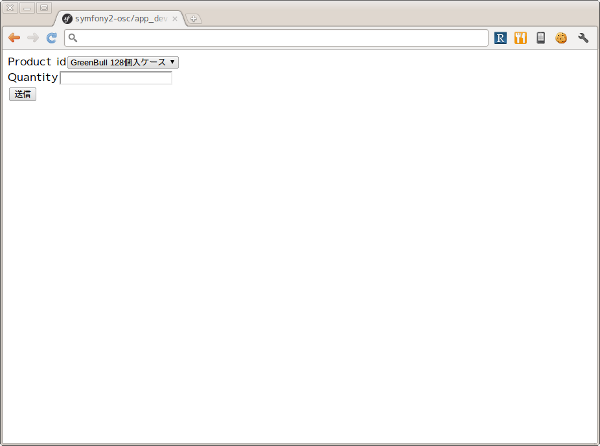

.. note:: ドメインオブジェクトの配置場所

    ジェネレータによって生成されるエンティティはデフォルトでバンドル配下のEntityディレクトリに配置されます。しかし、エンティティを始めとするドメインオブジェクトは我々のドメインのものであり、Symfony独自のシステムであるバンドルからは本質的に独立したものです。例えば、Symfony以外のフレームワークを使った別のアプリケーションで同じエンティティを共有するケースを考えてみてください。適切な配置先はどこでしょうか？バンドルと同じソースツリーに配置するのであれば **src/ApplicationNamespace/Domain** ディレクトリを使うことは良い選択です。複数のプロジェクトから共有される場合は、ドメインオブジェクトのみを別のプロジェクトとすることができます。ただし、この選択は実際の要求があるまで遅らせることができます。

2つ目のページ - 配送先情報入力ページ
------------------------------------

次に2つ目のページである **配送先情報入力ページ** を実装します。このページの **URL** は **/order/address** とします。

**リクエストメソッド** が **GET** の場合は配送先情報入力フォームを出力します。 **POST** の場合は送信されたデータを検証してから次のページに遷移します。

ルートの定義
^^^^^^^^^^^^

前述の商品選択ページの場合ジェネレータによって生成されたルートを変更しましたが、このページには対応するルートがありませんので最初にルートを定義しましょう。defaults配列の_controller要素の値は、このルートのアクションがDrinkOrderController::addressAction()メソッドであることを示しています。

**Resources/config/routing.yml** :

.. code-block:: yaml

    ...
    OscDrinkOrderBundle_address:
        pattern:  /order/address
        defaults: { _controller: OscDrinkOrderBundle:DrinkOrder:address }

配送先情報入力フォームの作成
^^^^^^^^^^^^^^^^^^^^^^^^^^^^

次にコントローラで配送先情報入力フォームを定義します。このフォームではname, address, phoneの3つのフィールドを入力できるようにします。nameはお名前、addressは住所、phoneは電話番号となっています。

**Controller/DrinkOrderController.php** :

.. code-block:: php

    ...
    class DrinkOrderController extends Controller
    {
    ...
        public function addressAction()
        {
            $form = $this->createFormBuilder(new DrinkOrder())
                ->add('name', 'text')
                ->add('address', 'text')
                ->add('phone', 'text')
                ->getForm();
            return $this->render('OscDrinkOrderBundle:DrinkOrder:address.html.twig', array('form' => $form->createView()));
        }

続いてaddressAction()メソッドから描画されるテンプレートを作成します。内容としては前述のproduct.html.twigとほぼ同じとなっておりform要素のaction属性の値が異なるだけです。

**Resources/views/DrinkOrder/address.html.twig** :

.. code-block:: html+jinja

    <form action="{{ path('OscDrinkOrderBundle_address') }}" method="post" {{ form_enctype(form) }}>
      {{ form_widget(form) }}
      <input type="submit" />
    </form>

この段階ではまだフォームを表示することはできません。フォームに定義したフィールドname, address, phoneのアクセサメソッドが存在しないためです。

エンティティの更新
^^^^^^^^^^^^^^^^^^

エンティティの作成に使った **app/console doctrine:generate:entity** コマンドは更新には対応していません。エンティティの更新を手作業で行うこともできますが、今回はデータベースと対応するフィールドの追加になるため、フィールドとセッタ・ゲッタメソッドすべての宣言を追加しなければならないので少々面倒です。さらにエンティティのみを更新すると、後でマッピング定義との同期を行うことになり、これも面倒です。幸いSymfonyのDoctrineインテグレーションはマッピング定義からのエンティティの自動更新をサポートしていますので、この方法で対応するのが良さそうです。

最初に以下のようにマッピング定義にname, address, phoneフィールドを追加しましょう。

**Resources/config/doctrine/DrinkOrder.orm.yml** :

.. code-block:: yaml

    ...
        quantity:
          type: integer
        name:
          type: string
          length: 255
        address:
          type: string
          length: 255
        phone:
          type: string
          length: 255
      lifecycleCallbacks: {  }

次に **app/console doctrine:generate:entities** コマンドを実行します。

.. code-block:: console

    $ app/console doctrine:generate:entities OscDrinkOrderBundle:DrinkOrder
    Generating entity "Osc\Bundle\DrinkOrderBundle\Entity\DrinkOrder"
      > generating Osc\Bundle\DrinkOrderBundle\Entity\DrinkOrder

以下はコマンド実行後のエンティティです。クラスの末尾にフィールドとセッタ・ゲッタメソッドが追加されたことがわかります。

**Entity/DrinkOrder.php** :

.. code-block:: php

    ...
        /**
         * Get quantity
         *
         * @return integer
         */
        public function getQuantity()
        {
            return $this->quantity;
        }
        /**
         * @var string $name
         */
        private $name;
    
        /**
         * @var string $address
         */
        private $address;
    
        /**
         * @var string $phone
         */
        private $phone;
    
    
        /**
         * Set name
         *
         * @param string $name
         */
        public function setName($name)
        {
            $this->name = $name;
        }
    
        /**
         * Get name
         *
         * @return string 
         */
        public function getName()
        {
            return $this->name;
        }
    
        /**
         * Set address
         *
         * @param string $address
         */
        public function setAddress($address)
        {
            $this->address = $address;
        }
    
        /**
         * Get address
         *
         * @return string 
         */
        public function getAddress()
        {
            return $this->address;
        }
    
        /**
         * Set phone
         *
         * @param string $phone
         */
        public function setPhone($phone)
        {
            $this->phone = $phone;
        }
    
        /**
         * Get phone
         *
         * @return string 
         */
        public function getPhone()
        {
            return $this->phone;
        }
    }

ただし、このようにバラバラとフィールドとメソッドが追加されるままにしておくとソースコードの可読性を下げてしまうため、手作業で適切な箇所に再配置しておくことをお勧めします。

では **http://symfony2-osc/app_dev.php/order/address** にアクセスし、配送先情報入力フォームが表示されることを確認しましょう。

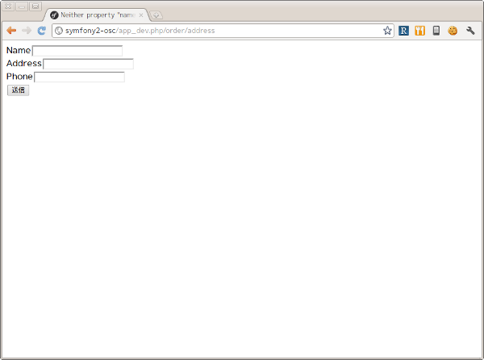

ページ遷移の実装
^^^^^^^^^^^^^^^^

これまでの実装で商品選択ページと配送先情報入力ページがそれぞれ表示されるようになりましたが、まだ2つのページは接続されていません。前述のページフローによれば、商品選択ページの送信ボタンをクリックすると配送先情報入力ページに遷移する必要があります。

最初にこの遷移を実現するためのルートを定義しましょう。

**Resources/config/routing.yml** :

.. code-block:: yaml

    OscDrinkOrderBundle_product:
        pattern:  /order
        defaults: { _controller: OscDrinkOrderBundle:DrinkOrder:product }
        requirements: { _method: GET }
    
    OscDrinkOrderBundle_product_post:
        pattern:  /order
        defaults: { _controller: OscDrinkOrderBundle:DrinkOrder:productPost }
        requirements: { _method: POST }
    ...

SymfonyではURLパターンに加えていくつものマッチパターンを指定することができます。ここでは同一のURLに対してリクエストメソッドによって異なるルートを定義しています。この方法には、1つのアクションの場合に必要になるif文をなくすことができるメリットがあります。新たなルートを機能させるために、元からあったルートに対してもリクエストメソッドの指定を行っていることに注意してください。

次にアクションを実装します。

**Controller/DrinkOrderController.php** :

.. code-block:: php

    ...
    public function productPostAction()
    {
        return $this->redirect($this->generateUrl('OscDrinkOrderBundle_address'));
    }

    public function addressAction()
    {
    ...

では **http://symfony2-osc/app_dev.php/order** にアクセスし、適当にフォームを埋めて送信ボタンをクリックしてみましょう。問題がなければ次のページに遷移するはずです。

続けて配送先情報入力ページから注文内容確認ページへの遷移も実装しましょう。遷移先のルートはまだありませんがルート名をOscDrinkOrderBundle_confirmationとしておきます。

**Resources/config/routing.yml** :

.. code-block:: yaml

    ...
    OscDrinkOrderBundle_address:
        pattern:  /order/address
        defaults: { _controller: OscDrinkOrderBundle:DrinkOrder:address }
        requirements: { _method: GET }
    
    OscDrinkOrderBundle_address_post:
        pattern:  /order/address
        defaults: { _controller: OscDrinkOrderBundle:DrinkOrder:addressPost }
        requirements: { _method: POST }

**Controller/DrinkOrderController.php** :

.. code-block:: php

    ...
    public function addressAction()
    {
    ...
    }

    public function addressPostAction()
    {
        return $this->redirect($this->generateUrl('OscDrinkOrderBundle_confirmation'));
    }

では先ほどと同様に **http://symfony2-osc/app_dev.php/order/address** にアクセスし、適当にフォームを埋めて送信ボタンをクリックしてみましょう。上手くいきましたか？

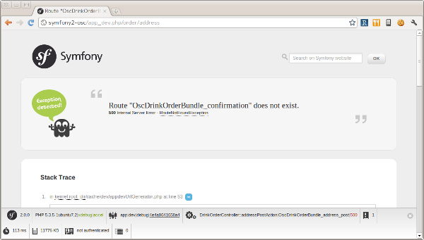

まだOscDrinkOrderBundle_confirmationへのルートを定義していないためエラーが発生しますが今のところこれは問題ではありません。遷移の実装は上手くいっています。

3つ目のページ - 注文内容確認ページ
----------------------------------

当面の目標はページフローの実装のみなので、残りの2つのページと遷移はこれまでの応用で一気に実装してしまいましょう。変更点は以下のようになります。

**Resources/config/routing.yml** :

.. code-block:: yaml

    ...
    OscDrinkOrderBundle_confirmation:
        pattern:  /order/confirmation
        defaults: { _controller: OscDrinkOrderBundle:DrinkOrder:confirmation }
        requirements: { _method: GET }
    
    OscDrinkOrderBundle_confirmation_post:
        pattern:  /order/confirmation
        defaults: { _controller: OscDrinkOrderBundle:DrinkOrder:confirmationPost }
        requirements: { _method: POST }

**Controller/DrinkOrderController.php** :

.. code-block:: php

    ...
    public function confirmationAction()
    {
        $form = $this->createFormBuilder(new DrinkOrder())->getForm();
        return $this->render('OscDrinkOrderBundle:DrinkOrder:confirmation.html.twig', array('form' => $form->createView()));
    }

    public function confirmationPostAction()
    {
        return $this->redirect($this->generateUrl('OscDrinkOrderBundle_success'));
    }

**Resources/views/DrinkOrder/confirmation.html.twig** :

.. code-block:: html+jinja

    <form action="{{ path('OscDrinkOrderBundle_confirmation') }}" method="post" {{ form_enctype(form) }}>
      {{ form_widget(form) }}
      <input type="submit" />
    </form>

変更が完了したら **http://symfony2-osc/app_dev.php/order/address** にアクセスし、配送先情報入力ページから注文内容確認ページ、注文内容確認ページから注文完了ページに遷移できるか確認しましょう。

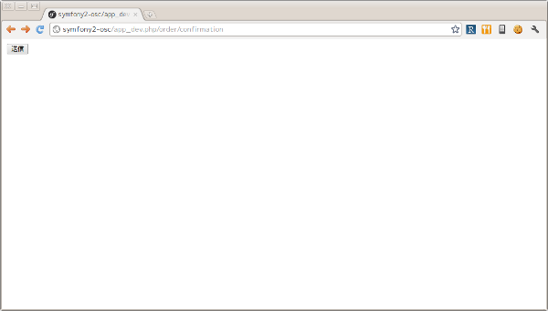

最後のページ - 注文完了ページ
-----------------------------

いよいよ最後のページです。変更点は以下のようになります。

**Resources/config/routing.yml** :

.. code-block:: yaml

    ...
    OscDrinkOrderBundle_success:
        pattern:  /order/success
        defaults: { _controller: OscDrinkOrderBundle:DrinkOrder:success }
        requirements: { _method: GET }

**Controller/DrinkOrderController.php** :

.. code-block:: php

    ...
    public function successAction()
    {
        return $this->render('OscDrinkOrderBundle:DrinkOrder:success.html.twig');
    }

**Resources/views/DrinkOrder/success.html.twig** :

.. code-block:: html+jinja

    ご注文ありがとうございました。

変更が完了したら **http://symfony2-osc/app_dev.php/order/confirmation** にアクセスし、注文内容確認ページから注文完了ページに遷移できるか確認しましょう。問題なければ、最初のページから最後のページまでの遷移を確認します。

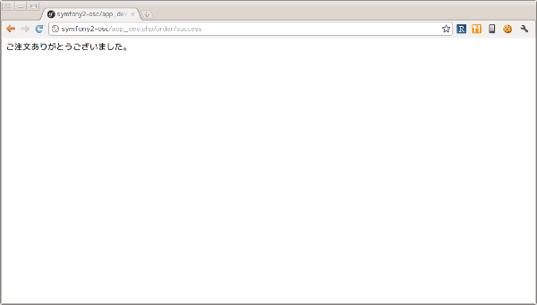

以上でページフローの実装はひとまず完了です。

レイアウトテンプレートの導入
----------------------------

これまで作ってきたページはまだ内容がありませんが、それにしても何か足りない気がしないでしょうか？ **Welcome** ページはどんな感じだったのか **http://symfony2-osc/app_dev.php/** にアクセスして確認してみましょう。

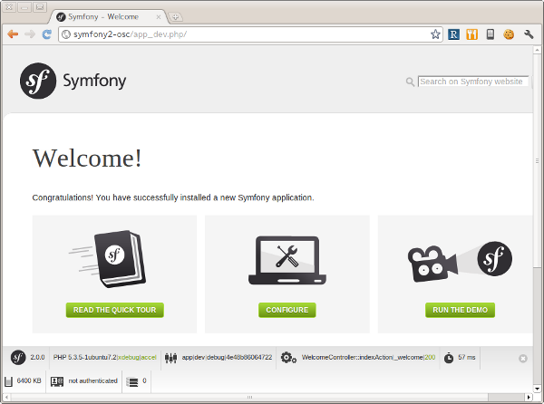

そうです、Welcomeページの下部にある **Webデバッグツールバー** がこれまで作ってきたページでは表示されないのです。Webデバッグツールバーが差し込まれるようにするには、レスポンスが **</body>** タグを含むHTMLページでなければなりません。

それぞれのページがHTML全体を表現するように変更を加えても構いませんが、ここはHTML全体の構造を表現する **レイアウトテンプレート** を作って、それぞれのページのテンプレートがそれを継承するようにしましょう。

最初にレイアウトテンプレートを作りましょう。

**Resources/views/layout.html.twig** :

.. code-block:: html+jinja

    <!DOCTYPE html>
    <html>
      <head>
        <meta http-equiv="Content-Type" content="text/html; charset=UTF-8" />
        <title>飲料注文アプリケーション</title>
        <link rel="shortcut icon" href="{{ asset('favicon.ico') }}" />
      </head>
      <body>
        

          
          
        

      </body>
    </html>

今回はStandard Editionに含まれるAcmeDemoBundleを参考に上記のようなテンプレートを作ってみました。contentブロックでページの内容、titleブロックでページのタイトルを表現しています。

次にレイアウトテンプレートを使うように、商品選択ページのテンプレートを変更しましょう。

.. code-block:: html+jinja

    
    
    商品選択 | {{ parent() }}
    
    
      <form action="{{ path('OscDrinkOrderBundle_product') }}" method="post" {{ form_enctype(form) }}>
        {{ form_widget(form) }}
        <input type="submit" />
      </form>
    

では商品選択ページを表示してみましょう。

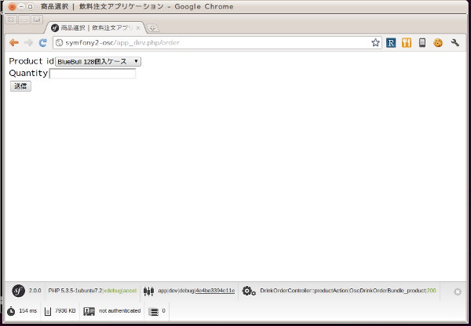

ご覧の通り無事ツールバーが表示されました。残りのテンプレートも同様に変更しておきましょう。

セッションの導入
================

ここまでで一方向ながらページフローの実装が完了しました。しかし注文内容確認ページにはせっかく入力した情報が表示されていませんし、そもそもリクエストをまたがるデータの保持については何も実装していない状態です。では早速セッションを導入してみましょう。

オブジェクトの登録
------------------

まずは最初のリクエストを担当するproductAction()メソッドを以下のように変更します。

**Controller/DrinkOrderController.php** :

.. code-block:: php

    ...
    public function productAction()
    {
        $this->container->get('session')->set('drinkOrder', new DrinkOrder());
        $form = $this->createFormBuilder($this->container->get('session')->get('drinkOrder'))
            ->add('product_id', 'choice', array( 'choices' => array('1' => 'BlueBull 128個入ケース', '2' => 'GreenBull 128個入ケース')))
            ->add('quantity', 'text')
            ->getForm();
        return $this->render('OscDrinkOrderBundle:DrinkOrder:product.html.twig', array('form' => $form->createView()));
    }
   ...

Symfonyはユーザセッションの状態を管理するために **session** サービスを使います。最初のリクエストでは新しいDrinkOrderオブジェクトをセッションに登録します。createFromBuilder()メソッドの引数にはセッションから取得したDrinkOrderオブジェクトを渡すようにします。

続いて送信ボタンをクリックされたときのアクションであるproductPostAction()メソッドを以下のように変更します。

**Controller/DrinkOrderController.php** :

.. code-block:: php

    ...
    public function productPostAction()
    {
        $form = $this->createFormBuilder($this->container->get('session')->get('drinkOrder'))
            ->add('product_id', 'choice', array( 'choices' => array('1' => 'BlueBull 128個入ケース', '2' => 'GreenBull 128個入ケース')))
            ->add('quantity', 'text')
            ->getForm();
        $form->bindRequest($this->getRequest());
        return $this->redirect($this->generateUrl('OscDrinkOrderBundle_address'));
    }
    ...

フォームから送信されたデータをDrinkOrderオブジェクトに結びつけるためには、フォーム表示の場合と同じ仕様を持つFormオブジェクトが必要になります。実際の結びつけには **Form::bindRequest()** メソッドを使います。残りのアクションについても同様の変更を行なっておきます。

次に注文内容確認ページに確認用の情報を表示させましょう。これにはセッションから取得したDrinkOrderオブジェクトを使うことができます。

**Controller/DrinkOrderController.php** :

.. code-block:: php

    ...
    public function confirmationAction()
    {
        $form = $this->createFormBuilder($this->container->get('session')->get('drinkOrder'))->getForm();
        return $this->render('OscDrinkOrderBundle:DrinkOrder:confirmation.html.twig', array(
            'form' => $form->createView(),
            'drinkOrder' => $this->container->get('session')->get('drinkOrder')
        ));
    }
    ...

**Resources/views/DrinkOrder/confirmation.html.twig** :

.. code-block:: html+jinja

    ...
    <ul>
      <li>商品: {{ drinkOrder.productId }}</li>
      <li>個数: {{ drinkOrder.quantity }}</li>
      <li>名前: {{ drinkOrder.name }}</li>
      <li>住所: {{ drinkOrder.address }}</li>
      <li>電話番号: {{ drinkOrder.phone }}</li>
    </ul>
    <form action="{{ path('OscDrinkOrderBundle_product') }}" method="post" {{ form_enctype(form) }}>
    ...

では最初のページにアクセスし、注文内容確認ページまで進めてみましょう。

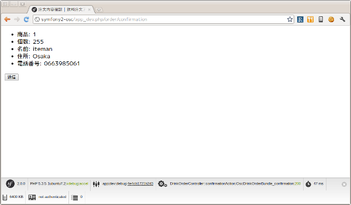

入力内容の修正
--------------

冒頭で示したページフローでは、入力内容の修正のために注文内容確認ページから商品選択ページ・配送先情報入力ページへ戻れるようになっていました。これをサポートするために配送先情報入力ページを変更しましょう。

**Resources/views/DrinkOrder/confirmation.html.twig** :

.. code-block:: html+jinja

    ...
      <form action="{{ path('OscDrinkOrderBundle_confirmation') }}" method="post" {{ form_enctype(form) }}>
        {{ form_widget(form) }}
        <input type="submit" />
      </form>
      

        <a href="{{ path('OscDrinkOrderBundle_product') }}">商品の再選択</a>
      

      

        <a href="{{ path('OscDrinkOrderBundle_address') }}">配送先情報の修正</a>
      

    

そういえばproductAction()メソッドでは新しいDrinkOrderオブジェクトを無条件でセッションに登録していましたので、セッションに存在しない場合のみ登録するように変更しておきます。

**Controller/DrinkOrderController.php** :

.. code-block:: php

    ...
    public function productAction()
    {
        if (!$this->container->get('session')->has('drinkOrder')) {
            $this->container->get('session')->set('drinkOrder', new DrinkOrder());
        }
        $form = $this->createFormBuilder($this->container->get('session')->get('drinkOrder'))
    ...

ではアクセスして動作を確認してみましょう。

注文完了時の初期化
------------------

今のままでは注文完了後に他のページにアクセスした場合にも前回の入力値が表示されてしまいますので、注文完了時はセッションからデータを削除しておく方がいいでしょう。

**Controller/DrinkOrderController.php** :

.. code-block:: php

    ...
    public function confirmationPostAction()
    {
        $form = $this->createFormBuilder($this->container->get('session')->get('drinkOrder'))->getForm();
        $form->bindRequest($this->getRequest());
        $this->container->get('session')->remove('drinkOrder');
        return $this->redirect($this->generateUrl('OscDrinkOrderBundle_success'));
    }
    ...

以上でセッションの導入は完了です。

フォームの組み立てコードの外部化
--------------------------------

セッションを導入したことでフォームの組み立てコードの重複が目立つようになりました。幸いSymfonyはフォームの組み立て処理を外部化するための仕組みを提供しています。フォームフィールドの組み合わせに対してそれぞれクラスを用意します。

**Form/Type/ProductDrinkOrderType.php** :

.. code-block:: php

    <?php
    namespace Osc\Bundle\DrinkOrderBundle\Form\Type;
    
    use Symfony\Component\Form\AbstractType;
    use Symfony\Component\Form\FormBuilder;
    
    class ProductDrinkOrderType extends AbstractType
    {
        public function buildForm(FormBuilder $builder, array $options)
        {
            $builder->add('product_id', 'choice', array( 'choices' => array('1' => 'BlueBull 128個入ケース', '2' => 'GreenBull 128個入ケース')));
            $builder->add('quantity', 'text');
        }
    
        public function getName()
        {
            return 'product_drink_order';
        }
    }
    
**Form/Type/AddressDrinkOrderType.php** :

.. code-block:: php

    <?php
    namespace Osc\Bundle\DrinkOrderBundle\Form\Type;
    
    use Symfony\Component\Form\AbstractType;
    use Symfony\Component\Form\FormBuilder;
    
    class AddressDrinkOrderType extends AbstractType
    {
        public function buildForm(FormBuilder $builder, array $options)
        {
            $builder->add('name', 'text');
            $builder->add('address', 'text');
            $builder->add('phone', 'text');
        }
    
        public function getName()
        {
            return 'address_drink_order';
        }
    }

これらのフォームタイプを使ってコントローラを書き換えます。

**Controller/DrinkOrderController.php** :

.. code-block:: php

    ...
    use Osc\Bundle\DrinkOrderBundle\Form\Type\AddressDrinkOrderType;
    use Osc\Bundle\DrinkOrderBundle\Form\Type\ProductDrinkOrderType;
    
    class DrinkOrderController extends Controller
    {
        public function productAction()
        {
            if (!$this->container->get('session')->has('drinkOrder')) {
                $this->container->get('session')->set('drinkOrder', new DrinkOrder());
            }
            $form = $this->createForm(new ProductDrinkOrderType(), $this->container->get('session')->get('drinkOrder'));
    ...
    
        public function addressAction()
        {
            $form = $this->createForm(new AddressDrinkOrderType(), $this->container->get('session')->get('drinkOrder'));
    ...

これでコードが随分すっきりしました。

バリデーションの実装
====================

次はフォーム入力値に対するバリデーションを実装します。バリデーションの対象となるのは、ページフローに現れるすべてのフォーム、すなわち商品選択フォーム、配送先情報入力フォーム、注文内容確認フォームの3つです。

最初のフォーム - 商品選択フォーム
---------------------------------

まずは最初のフォームである商品選択フォームから実装していきましょう。

**Resources/config/validation.yml** :

.. code-block:: yaml

    Osc\Bundle\DrinkOrderBundle\Entity\DrinkOrder:
      properties:
        product_id:
          - NotBlank: ~
          - Min: 1
          - Max: 2
        quantity:
          - NotBlank: ~
          - Min: 1
          - Max: 8

**Form::isValid()** メソッドによるフォームのバリデーションの実体は、Formオブジェクトに設定されているドメインオブジェクトに対するバリデーションの呼び出しです。よって今回はDrinkOrderエンティティに対して **制約** と呼ばれるバリデーションのルールを定義する必要があります。

制約の定義が完了したら適切な場所でForm::isValid()メソッドを呼び出すようにコントローラを変更します。

**Controller/DrinkOrderController.php** :

.. code-block:: php

    ...
    public function productPostAction()
    {
        $form = $this->createForm(new ProductDrinkOrderType(), $this->container->get('session')->get('drinkOrder'));
        $form->bindRequest($this->getRequest());
        if ($form->isValid()) {
            return $this->redirect($this->generateUrl('OscDrinkOrderBundle_address'));
        } else {
            return $this->render('OscDrinkOrderBundle:DrinkOrder:product.html.twig', array('form' => $form->createView()));
        }
    }
    ...

バリデーションが成功した場合は今までどおりに配送先情報入力ページにリダイレクトします。失敗した場合は再度フォームを表示します。

変更が完了したら動作確認を行います。わざとバリデーションを失敗させてみましょう。元のフォームにエラーメッセージが表示されればコードは正しく動作しています。

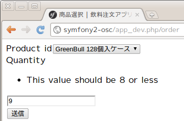

2つ目のフォーム - 配送先情報入力フォーム
----------------------------------------

続いて2つ目のフォーム、配送先情報入力フォームの実装です。まずは先ほどと同じように制約を定義し、コントローラを変更します。

**Resources/config/validation.yml** :

.. code-block:: yaml

    ...
    name: &text
      - NotBlank: ~
      - MaxLength: 16
    address: *text
    phone: *text

**Controller/DrinkOrderController.php** :

.. code-block:: php

    ...
    public function addressPostAction()
    {
        $form = $this->createForm(new AddressDrinkOrderType(), $this->container->get('session')->get('drinkOrder'));
        $form->bindRequest($this->getRequest());
        if ($form->isValid()) {
            return $this->redirect($this->generateUrl('OscDrinkOrderBundle_confirmation'));
        } else {
            return $this->render('OscDrinkOrderBundle:DrinkOrder:address.html.twig', array('form' => $form->createView()));
        }
    }
    ...

では最初のページから動作確認してみてください。

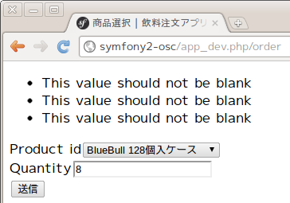

商品選択フォームで正しい値を入力したにも関わらず、新たに追加した制約の数のエラーが発生してしまいました。これは新たな制約が機能しているからであり正しい動作です。我々はそれぞれのフォームタイプに対応するフィールドのみをバリデーションしたいのですが、そのためにはどうすればいいのでしょうか？

この問題に対する1つの解決策は `バリデーショングループ <http://symfony.com/doc/2.0/book/validation.html#validation-groups>`_ の使用です。まずバリデーション定義を以下のように変更しましょう。

**Resources/config/validation.yml** :

.. code-block:: yaml

    Osc\Bundle\DrinkOrderBundle\Entity\DrinkOrder:
      properties:
        product_id:
          - NotBlank: { groups: [product] }
          - Min: { limit: 1, groups: [product] }
          - Max: { limit: 2, groups: [product] }
        quantity:
          - NotBlank: { groups: [product] }
          - Min: { limit: 1, groups: [product] }
          - Max: { limit: 8, groups: [product] }
        name: &text
          - NotBlank: { groups: [address] }
          - MaxLength: { limit: 16, groups: [address] }
        address: *text
        phone: *text

ご覧のように制約毎にgroups要素を定義しており、その値によって制約をグループ化することができます。次にフォームバリデーションでバリデーショングループを使うためにコントローラを以下のように変更します。

**Controller/DrinkOrderController.php** :

.. code-block:: php

    ...
    public function productPostAction()
    {
        $form = $this->createForm(
            new ProductDrinkOrderType(),
            $this->container->get('session')->get('drinkOrder'),
            array('validation_groups' => array('product'))
        );
        $form->bindRequest($this->getRequest());
    ...
    public function addressPostAction()
    {
        $form = $this->createForm(
            new AddressDrinkOrderType(),
            $this->container->get('session')->get('drinkOrder'),
            array('validation_groups' => array('address'))
        );
        $form->bindRequest($this->getRequest());
    ...

では動作確認を行いましょう。

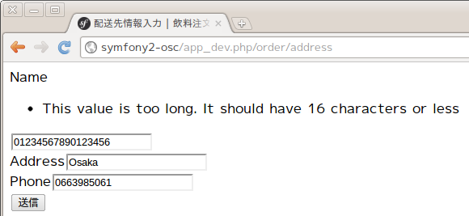

今度は上手くいきました。

.. note:: 文脈依存のバリデーション (Contextual Validation)

    同一のドメインオブジェクトに対して文脈毎に異なるバリデーションを行いたい場合があります。今回の例のような同一ページフロー中のフォーム毎のバリデーションも文脈依存のバリデーションといえますが、異なるアプリケーションで必要になる場合もあるでしょう。例えば、アカウント登録時にはユーザオブジェクトに対してメールアドレスとログインパスワードのバリデーションを行い、アカウント情報変更時にはユーザオブジェクトに対して電話番号や住所のバリデーションを行う、といった具合です。筆者はバリデーションの再利用は制約単位よりもフィールド単位の方が有用だと考えていますので現在のバリデーショングループが使いやすいとは思っておらず、現在優れた実装パターンを模索中です。文脈毎にドメインオブジェクトを継承し、それに対するバリデーションを定義するという方法は良さそうに思えますが、Symfonyの実装に阻まれており(クラスの継承によってバリデーション定義も継承されるのです！)実現には至っておりません。何か良いアイデアがあれば是非筆者までご連絡ください。

最後のフォーム - 注文内容確認フォーム
-------------------------------------

最後に3つ目のフォーム、注文内容確認フォームの実装です。このフォームにはバリデーションすべきフィールドがありませんので、実装はコントローラの変更のみとなります。

**Controller/DrinkOrderController.php** :

.. code-block:: php

    ...
    public function confirmationPostAction()
    {
        $form = $this->createFormBuilder($this->container->get('session')->get('drinkOrder'))->getForm();
        $form->bindRequest($this->getRequest());
        if ($form->isValid()) {
            $this->container->get('session')->remove('drinkOrder');
            return $this->redirect($this->generateUrl('OscDrinkOrderBundle_success'));
        } else {
            return $this->render('OscDrinkOrderBundle:DrinkOrder:confirmation.html.twig', array(
                'form' => $form->createView(),
                'drinkOrder' => $this->container->get('session')->get('drinkOrder')
            ));
        }
    }
    ...

以上でバリデーションの実装は完了です。

データベースへのオブジェクトの保存
==================================

そのそろこの辺で注文内容をデータベースに保存することにしましょう。

テーブルの作成
--------------

現段階ではDrinkOrderオブジェクトの保存先となるテーブルすら存在しておりませんので **app/console doctrine:schema:create** コマンドを使ってテーブルを作成します。

.. code-block:: console

    $ app/console doctrine:schema:create
    ATTENTION: This operation should not be executed in a production environment.
    
    Creating database schema...
    Database schema created successfully!

成功したようです。念のためデータベースを確認しておきます。

.. code-block:: console

    mysql> show tables;
    +------------------------+
    | Tables_in_symfony2_osc |
    +------------------------+
    | drink_order            |
    +------------------------+
    1 row in set (0.00 sec)

オブジェクトの保存
------------------

次にコントローラを以下のように変更します。

**Controller/DrinkOrderController.php** :

.. code-block:: php

    ...
    public function confirmationPostAction()
    {
        $form = $this->createFormBuilder($this->container->get('session')->get('drinkOrder'))->getForm();
        $form->bindRequest($this->getRequest());
        if ($form->isValid()) {
            $em = $this->getDoctrine()->getEntityManager();
            $em->persist($this->container->get('session')->get('drinkOrder'));
            $em->flush();
            $this->container->get('session')->remove('drinkOrder');
            return $this->redirect($this->generateUrl('OscDrinkOrderBundle_success'));
        } else {
    ...

コントローラのインスタンスを経由して取得したEntityManagerオブジェクトの **persist()** メソッドにセッションに保存されているDrinkOrderオブジェクトを渡しています。 **flush()** メソッドの呼び出しによって実際の保存が行われることになります。

では動作確認を行い、注文が完了したらデータベースを確認しましょう。

.. code-block:: console

    mysql> select * from drink_order;
    +----+------------+----------+--------+---------+------------+
    | id | product_id | quantity | name   | address | phone      |
    +----+------------+----------+--------+---------+------------+
    |  1 |          2 |        8 | iteman | Osaka   | 0663985061 |
    +----+------------+----------+--------+---------+------------+
    1 row in set (0.00 sec)

どうやら成功したようです。

ページフローの制御とCSRF対策
============================

前のセクションでアプリケーションの動作としてはほぼ完成の段階に来ましたが、今のままではいきなり中間のページにアクセスされた場合の対策がありません。これに対してはページフローの制御を行うことで予期しない動作を防ぐ必要があります。加えてCSRF対策を行いアプリケーションのセキュリティを高める必要もあります。

ページフローの制御
------------------

ここで冒頭に示したページフローを再度見てみましょう。

.. image:: images/page-flow.png

予期しないアプリケーションの動作を防ぐためはフローのルートを制御する必要があります。とはいってもSymfonyの標準機能では完全な制御は難しいため、条件分岐が拡散しすぎない程度に留めておくのが現実的でしょう。

ここでは予期しない遷移を検出した場合に商品選択ページにリダイレクトするようにコントローラを変更します。

**Controller/DrinkOrderController.php** :

.. code-block:: php

    ...
    const STATE_PRODUCT = 'STATE_PRODUCT';
    const STATE_ADDRESS = 'STATE_ADDRESS';
    const STATE_CONFIRMATION = 'STATE_CONFIRMATION';
    const STATE_SUCCESS = 'STATE_SUCCESS';

    public function productAction()
    {
        $this->container->get('session')->set('state', self::STATE_PRODUCT);
    ...

    public function productPostAction()
    {
        if (!($this->container->get('session')->has('state')
              && $this->container->get('session')->get('state') == self::STATE_PRODUCT)) {
            return $this->redirect($this->generateUrl('OscDrinkOrderBundle_product'));
        }
    ...
        if ($form->isValid()) {
            $this->container->get('session')->set('state', self::STATE_ADDRESS);
    ...

    public function addressAction()
    {
        if (!($this->container->get('session')->has('state')
              && ($this->container->get('session')->get('state') == self::STATE_ADDRESS
                  || $this->container->get('session')->get('state') == self::STATE_CONFIRMATION))) {
            return $this->redirect($this->generateUrl('OscDrinkOrderBundle_product'));
        }

        $this->container->get('session')->set('state', self::STATE_ADDRESS);
    ...

    public function addressPostAction()
    {
        if (!($this->container->get('session')->has('state')
              && $this->container->get('session')->get('state') == self::STATE_ADDRESS)) {
            return $this->redirect($this->generateUrl('OscDrinkOrderBundle_product'));
        }
    ...
        if ($form->isValid()) {
            $this->container->get('session')->set('state', self::STATE_CONFIRMATION);
    ...

    public function confirmationAction()
    {
        if (!($this->container->get('session')->has('state')
              && $this->container->get('session')->get('state') == self::STATE_CONFIRMATION)) {
            return $this->redirect($this->generateUrl('OscDrinkOrderBundle_product'));
        }
    ...

    public function confirmationPostAction()
    {
        if (!($this->container->get('session')->has('state')
              && $this->container->get('session')->get('state') == self::STATE_CONFIRMATION)) {
            return $this->redirect($this->generateUrl('OscDrinkOrderBundle_product'));
        }
    ...
        if ($form->isValid()) {
            $em = $this->getDoctrine()->getEntityManager();
            $em->persist($this->container->get('session')->get('drinkOrder'));
            $em->flush();
            $this->container->get('session')->remove('state');
            $this->container->get('session')->setFlash('state', self::STATE_SUCCESS);
            $this->container->get('session')->remove('drinkOrder');
    ...

    public function successAction()
    {
        if (!($this->container->get('session')->hasFlash('state')
              && $this->container->get('session')->getFlash('state') == self::STATE_SUCCESS)) {
            return $this->redirect($this->generateUrl('OscDrinkOrderBundle_product'));
        }
    ...

変更が終わったら実際にいろいろなルートをチェックしてみましょう。例えば、新規セッションで **http://symfony2-osc/app_dev.php/order/success** にアクセスします。完了ページが表示されずに、商品選択ページが表示されればOKです。

.. note:: ページフローエンジン

    `Piece_Flow <http://redmine.piece-framework.com/projects/piece-flow>`_ のようなページフローエンジンを使うことで、ページフローを完全に制御することが極めて簡単になります。残念ながらPiece_FlowのSymfonyインテグレーションはまだありません。作者のやる気自体はあるようですがリソース不足のため後回しになっています…

CSRF対策
--------

Webページ閲覧者に対する代表的な攻撃手法の一つである `クロスサイトリクエストフォージェリ(CSRF: Cross-site request forgery) <http://ja.wikipedia.org/wiki/%E3%82%AF%E3%83%AD%E3%82%B9%E3%82%B5%E3%82%A4%E3%83%88%E3%83%AA%E3%82%AF%E3%82%A8%E3%82%B9%E3%83%88%E3%83%95%E3%82%A9%E3%83%BC%E3%82%B8%E3%82%A7%E3%83%AA>`_ ですが実はすでに対策は完了しています。これはFormオブジェクトにはデフォルトでCSRF対策が組み込まれおり、form_widget()関数によって各フォームに埋めこまれている検証用文字列(**トークン**)がForm::isValid()メソッドの呼び出しによって検証されているためです。

実際にブラウザのツールを使ってトークンを確認してみましょう。

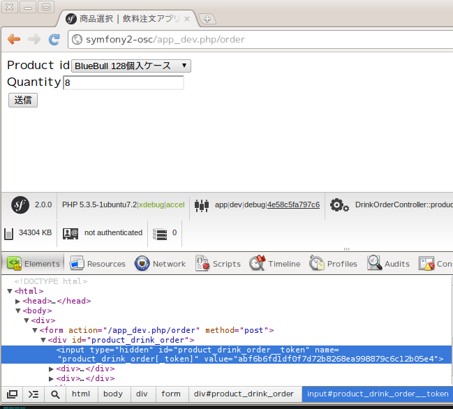

さらにトークンの値を変更してバリデーションエラーが発生することも確認してみましょう。

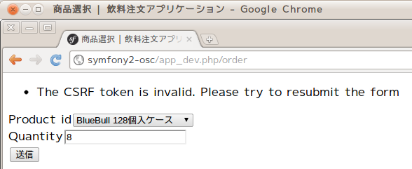

まとめ
======

*最もよくできたアーキテクチャフレームワークは、複雑な技術的問題を解決する一方で、ドメイン開発者がモデルを表現することに集中できるようにする。しかし、フレームワークは、ドメインについての設計の選択肢を制限する前提を多く設けすぎたり、開発の速度を低下させるほど実装を重苦しくしてしまったりすることで、用意に開発の妨げとなり得るのだ。
...
フレームワークを適用する場合、チームはその目標に集中しなければならない。それはすなわち、ドメインモデルを表現し、重要な問題を解決するためにそのモデルを使用するような実装を構築するということである。チームは、この目標を達成するためにフレームワークを採用する道を模索しなければならない。それがフレームワークのすべての機能を使用しないことを意味しても構わない。(『エリック・エヴァンスのドメイン駆動設計』より)*

このチュートリアルではSymfonyのWebアプリケーションフレームワーク部分にフォーカスを当ててきました。そしてWebアプリケーションの技術的課題の多くがSymfonyによって解決されることの一端をお見せすることができたのではないかと思います。

アプリケーション開発者にとって最も重要なのは、対象領域の本質的な知識をドメインモデルとして体系化し、それをドメインオブジェクトとしてソフトウェアに落としこむことで現実世界で機能させることです。PHPの数あるアーキテクチャフレームワークの中でも、Symfonyはそのような活動において最も効果を発揮するものの一つだといえるでしょう。

参考
====

* `フォーム | Symfony2日本語ドキュメント <http://docs.symfony.gr.jp/symfony2/book/forms.html>`_
* `ルーティング | Symfony2日本語ドキュメント <http://docs.symfony.gr.jp/symfony2/book/routing.html#controller-string-syntax>`_
* `Symfony - Validation <http://symfony.com/doc/2.0/book/validation.html>`_
* `ビジネスオブジェクト - Wikipedia <http://ja.wikipedia.org/wiki/%E3%83%93%E3%82%B8%E3%83%8D%E3%82%B9%E3%82%AA%E3%83%96%E3%82%B8%E3%82%A7%E3%82%AF%E3%83%88>`_
* `ドメインモデル - Wikipedia <http://ja.wikipedia.org/wiki/%E3%83%89%E3%83%A1%E3%82%A4%E3%83%B3%E3%83%A2%E3%83%87%E3%83%AB>`_
* `『エリック・エヴァンスのドメイン駆動設計 (IT Architects’Archive ソフトウェア開発の実践 )』、翔泳社、2011年、ISBN 978­4798121963 <http://www.amazon.co.jp/%E3%82%A8%E3%83%AA%E3%83%83%E3%82%AF%E3%83%BB%E3%82%A8%E3%83%B4%E3%82%A1%E3%83%B3%E3%82%B9%E3%81%AE%E3%83%89%E3%83%A1%E3%82%A4%E3%83%B3%E9%A7%86%E5%8B%95%E8%A8%AD%E8%A8%88-Architects%E2%80%99Archive-%E3%82%BD%E3%83%95%E3%83%88%E3%82%A6%E3%82%A7%E3%82%A2%E9%96%8B%E7%99%BA%E3%81%AE%E5%AE%9F%E8%B7%B5-%E3%82%A8%E3%83%AA%E3%83%83%E3%82%AF%E3%83%BB%E3%82%A8%E3%83%B4%E3%82%A1%E3%83%B3%E3%82%B9/dp/4798121967>`_
* `ContextualValidation <http://martinfowler.com/bliki/ContextualValidation.html>`_
* `クロスサイトリクエストフォージェリ(CSRF: Cross-site request forgery) <http://ja.wikipedia.org/wiki/%E3%82%AF%E3%83%AD%E3%82%B9%E3%82%B5%E3%82%A4%E3%83%88%E3%83%AA%E3%82%AF%E3%82%A8%E3%82%B9%E3%83%88%E3%83%95%E3%82%A9%E3%83%BC%E3%82%B8%E3%82%A7%E3%83%AA>`_
