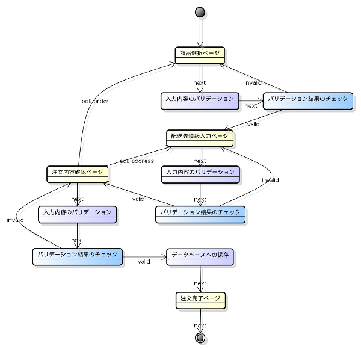

.. -*- coding: utf-8; -*-
==================
PHPフレームワークSymfony2 開発チュートリアル
==================
------------------------------------------------------
2011/08/20 オープンソースカンファレンス2011 Nagoya
日本Symfonyユーザー会
Piece Project
------------------------------------------------------

飲料注文アプリケーション
====

今回作成するのはオンラインで飲料を注文するためのアプリケーションです。このアプリケーションは以下のようなページフローを持ちます。

1. 最初のページではページ上から商品と個数を選択します。
2. 2番目のページでは配送先情報を入力します。
3. 3番目のページでは注文内容を確認し、問題なければ注文を確定します。内容を変更したい場合は最初のページか2番目のページに戻って再度情報を入力します。
4. 注文が確定するとお礼が書かれた最後のページを表示されます。

それぞれのページの入力内容は次のページを表示する前に検証を行います。注文を確定する際には再度すべての入力内容を検証し、注文をデータベースに保存する必要があります。これらを踏まえたページフローの全体像は以下のようになります。

では早速アプリケーションの作成に取り掛かります。

バンドルの作成
====

Symfonyではフレームワークが提供する機能だけではなく、ユーザのアプリケーションもバンドルとして作成する必要があります。バンドルの設計については様々な観点から試行錯誤する必要がありますが、ここでは飲料注文アプリケーションを単一のバンドル(以下 **アプリケーションバンドル** )とします。

新たにバンドルを作成する方法としては以下のものがあります。今回はコマンドラインの対話式ジェネレータを使うことにします。

1. Standard Editionに含まれるAcmeDemoBundleを使用する。
2. Standard Editionに含まれるAcmeDemoBundleをコピーしたものを使用する。
3. コマンドラインの対話式ジェネレータで雛形を生成する。

ではターミナルから **app/console generate:bundle** コマンドを実行しましょう。

.. code-block:: bash

    $ app/console generate:bundle
    
                                                
      Welcome to the Symfony2 bundle generator  
                                                
    
    
    Your application code must be written in bundles. This command helps
    you generate them easily.
    
    Each bundle is hosted under a namespace (like Acme/Bundle/BlogBundle).
    The namespace should begin with a "vendor" name like your company name, your
    project name, or your client name, followed by one or more optional category
    sub-namespaces, and it should end with the bundle name itself
    (which must have Bundle as a suffix).
    
    Use / instead of \ for the namespace delimiter to avoid any problem.
    
    Bundle namespace: Osc/Bundle/DrinkOrderBundle <--- 飲料注文アプリケーションの名前空間を入力する。
    In your code, a bundle is often referenced by its name. It can be the
    concatenation of all namespace parts but it's really up to you to come
    up with a unique name (a good practice is to start with the vendor name).
    Based on the namespace, we suggest OscDrinkOrderBundle.
    
    Bundle name [OscDrinkOrderBundle]: <--- そのままEnterキーを押す。
    The bundle can be generated anywhere. The suggested default directory uses
    the standard conventions.
    
    Target directory [/home/iteman/GITREPOS/symfony2-osc/Symfony/src]: <--- そのままEnterキーを押す。
    Determine the format to use for the generated configuration.
    
    Configuration format (yml, xml, php, or annotation) [annotation]: yml <--- 設定のフォーマットをYAMLにする。
    To help you getting started faster, the command can generate some
    code snippets for you.
    
    Do you want to generate the whole directory structure [no]? yes
                                 
      Summary before generation  
                                 
    
    You are going to generate a "Osc\Bundle\DrinkOrderBundle\OscDrinkOrderBundle" bundle
    in "/home/iteman/GITREPOS/symfony2-osc/Symfony/src/" using the "yml" format.
    
    Do you confirm generation [yes]? <--- そのままEnterキーを押す。
                         
      Bundle generation  
                         
    
    Generating the bundle code: OK
    Checking that the bundle is autoloaded: OK
    Confirm automatic update of your Kernel [yes]? Enabling the bundle inside the Kernel: OK
    Confirm automatic update of the Routing [yes]? Importing the bundle routing resource: OK
    
                                                   
      You can now start using the generated code!  
                                                   
    

src/Osc/Bundle/DrinkOrderBundle/Resources/public
src/Osc/Bundle/DrinkOrderBundle/Resources/public/css
src/Osc/Bundle/DrinkOrderBundle/Resources/public/js
src/Osc/Bundle/DrinkOrderBundle/Resources/public/images
src/Osc/Bundle/DrinkOrderBundle/Resources/doc
src/Osc/Bundle/DrinkOrderBundle/Resources/doc/index.rst
src/Osc/Bundle/DrinkOrderBundle/Resources/translations
src/Osc/Bundle/DrinkOrderBundle/Resources/translations/messages.fr.xliff

